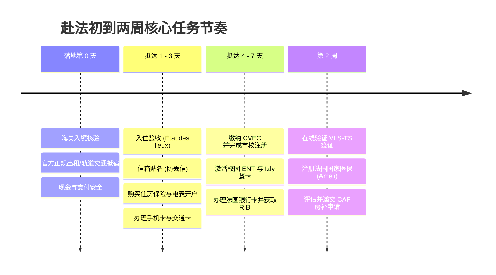

# 初到法国：落地两周通关清单

!!! abstract "速览"
    * **入住四件套**：验收房屋现状（État des lieux）、贴好信箱姓名（防丢件）、购买住房保险并办理电表过户。
    * **高校报到**：完成 CVEC 缴费，携带证明到校注册，领取学生卡并开通 Izly 校园餐卡。
    * **金融与身份**：预约开立法国银行账户获取 RIB；入境 3 个月内在 ANEF 平台在线验证 VLS-TS 签证。
    * **社保与房补**：完成学籍注册后申办 Ameli 医保；取得正规租房合同与 RIB 后在线递交 CAF 房补。

抵达法国的前两周是各项行政与生活事务集中爆发的窗口期。按照**全景时间线与优先级**推进，能够让你在最短时间内完成身份合法化、校园报到与生活安顿，彻底杜绝材料疏漏与罚款退件。

!!! tip "遇到人身或财产突发危险？"
    法国法定紧急呼叫热线（112 欧洲通用急救、15 SAMU 医疗急救、17 治安报警、18 消防救援）已汇总至专页 👉 **[法国紧急求助与应急电话指南](../../help/emergency.md)**；涉外安全与领保求助请查阅 👉 **[中国驻法使领馆求助指南](../../help/embassy.md)**。

## 📅 落地任务全景时间线

---

## 阶段零：落地当天（入境通关与交通抵宿）

* [ ] **随身文件袋检查**：下飞机通关海关时，请将**护照原件、签证页、学校录取/在读证明、住房证明（或酒店预订单）**集中放在随身小包中，以备边境警察随时核验。
* [ ] **从机场/车站前往住所**：
  * **乘坐官方出租车（Taxi）**：务必在航站楼顺着官方出租车指示标牌（Station Taxi）排队上车，**严禁搭乘机场大厅内主动搭讪揽客的非法黑车**。巴黎等大城市往返机场与市区通常实行法定固定一口价（Forfait）。
  * **乘坐公共交通**：各大城市机场均有直达市区的轻轨、地铁或机场快线大巴（如巴黎 RER B、图卢兹 Navette / T2、里昂 Rhônexpress）。
* [ ] **随身现金与支付习惯**：法国日常支付以银行卡和无接触支付（Sans contact、Apple Pay 等）为主，但部分商家可能设置最低刷卡金额，落地初期随身携带 **50～100€** 现金即可应付小额支出。建议以 **20€、50€ 纸币**为主——大面额纸币（100€ 以上）容易被拒收，行前换汇面额建议详见 **[行李清单建议](../before/packing-list.md)**。

---

## 阶段一：抵法前 3 天（安顿入住与基础通信）

### 1. 入住安顿与房屋验收 (État des lieux)
* [ ] **签署房屋现状检查（État des lieux d'entrée）**：与房东或宿管逐项检查水龙头、门锁、窗户、电磁炉、暖气及墙面。**务必在当天拍摄所有设备瑕疵并在检查单上书面注明**，这是退房退回押金的唯一定效凭据。
* [ ] **购买住房保险（Assurance habitation）**：根据法国法律，租客承担房屋火灾与水损风险，领钥匙时通常必须出示保险证明（Attestation d'assurance）。可通过银行、学生保险（HEYME/LMDE）或各大保险平台即买即生效。
* [ ] **电表过户与开户（若非全包合同）**：如果入住的是私人整租（Studio/Appartement）且房租不包电费，**入住当天必须联系供电商（如 EDF）开户过户**，报上 Linky 电表编号（PRM）及当天电表底数，避免因前房客销户而被断电断暖。
* [ ] ⚠️ **信箱贴名（极其关键，防重要信件丢失）**：入住当天立即用标签纸**将本人的法文拼音全名端正贴在门外信箱（Boîte aux lettres）上**！法国邮政（La Poste）投递极其严格，若信箱无名，银行卡、医保信件、居留通知将直接作“查无此人”退回！
* 📖 **深度指引**：详见 **[住宿与租房实操指南](../../life/housing.md)**。

### 2. 办理法国手机卡
* [ ] **快速开通可用号码**：
  * **实体门店即买即取**：前往 **Free Mobile** 线下实体门店，在自助贩卖机上刷国际信用卡即可当场吐卡，无需法国银行 RIB，按月扣费无合约。
  * **预付卡应急**：亦可在超市或烟草店（Tabac）购买预付费卡（Carte prépayée）临时过渡。
* [ ] **后续套餐优化**：开通法国银行账户后，可拨打 `3179` 索取 RIO 码，无缝**携号转网**至三大运营商旗下低价品牌（Sosh, RED by SFR, B&You）。
* 📖 **深度指引**：详见 **[法国手机卡办理指南](../../life/communication/sim-card.md)**。

### 3. 申办本地学生交通卡
* [ ] **办理学生交通优惠**：前往所在城市公共交通营业网点（如巴黎 RATP / 图卢兹 Tisséo / 里昂 TCL），凭护照与在读证明办理学生年卡（如 Imagine R / Pastel），享受大幅折扣。
* 📖 **深度指引**：详见各城市专区（如 **[图卢兹本地交通](../../toulouse/transport.md)**）或 **[城市公共交通指南](../../life/transport/bus.md)**。

---

## 阶段二：第 4～7 天（学业行政与财务账户）

### 4. 缴纳 CVEC 与学校行政注册
* [ ] **在线缴纳 CVEC 学生生活税**：访问 [cvec.etudiant.gouv.fr](https://cvec.etudiant.gouv.fr/) 在线缴费（或确认奖学金豁免），下载缴费证明（Attestation d'acquittement）。
* [ ] **教务处完成行政注册（Inscription administrative）**：提交护照、签证、录取文件与 CVEC 证明，领取学生卡（Carte d'étudiant）和在读证明（Certificat de scolarité）。
* [ ] **激活校园内网（ENT）与校园邮箱**：激活大学专属账号，关联个人选课、考勤与教务通知；校园邮箱还可用于解锁各类教育优惠（如 GitHub Student Developer Pack、Office 365 等）。
* [ ] **开通 Izly 校园支付账户**：激活由 CROUS 运营的 Izly 校园电子钱包，用于大学食堂（Resto U）刷卡就餐（享受廉价优质学生餐）以及校园图书馆打印复印。

### 5. 开设法国银行账户并获取 RIB
* [ ] **网点面签预约（RDV）或线上申办**：携带护照、学生签证/居留证明、当年在读证明、近 3 个月住房证明前往约定网点面签。
* [ ] **第一时间下载 RIB / IBAN**：网银开通后，第一时间在手机银行 App 内导出法国 **RIB（银行明细单）**，用于后续 CAF 房补、Ameli 医保、手机月租自动扣款。
* 📖 **深度指引**：详见 **[法国银行开户实操指南](../../life/finance/bank.md)**。

---

## 阶段三：第 2 周（居留身份与行政保障）

### 6. 在线验证 VLS-TS 学生长期签证（OFII）
* [ ] **ANEF 平台在线登记**：持 VLS-TS 学生签证入境后，**法律要求必须在 3 个月内完成在线验证**。访问法国移民局外国人家园平台（ANEF），填写入境日期、住址并购买支付电子印花税。
* [ ] **妥善保存验证证明**：下载并打印系统生成的 **Validation de VLS-TS**，它与签证页共同构成在法首年合法居留的凭证。
* 📖 **深度指引**：详见 **[办理学生居留与签证验证](residence.md)**。

### 7. 注册法国国家社会医疗保险 (Ameli)
* [ ] **外籍学生专属平台申请**：访问专属入口 [etudiant-etranger.ameli.fr](https://etudiant-etranger.ameli.fr)，上传护照、签证、在读证明、出生公证双认证与法国银行 RIB。
* [ ] **获取临时社保号与权利证明**：材料初审后即可下载权利证明（Attestation de droits），凭此即可享受看病 70% 报销，无需等待实体卡寄到。
* 📖 **深度指引**：详见 **[Ameli 注册与健康保险办理](ameli.md)** 及 **[法国看病就医指南](../../life/health.md)**。

### 8. 评估并申请 CAF 住房补贴 (APL)
* [ ] **2026 资格审查**：确认自身是否符合 2026 年非欧盟留学生新政要求（如拥有 CROUS 社会标准奖学金、受薪工作、学徒合同等）。
* [ ] **官网在线递交**：符合条件者在 [caf.fr](https://www.caf.fr) 创建账户并提交房租与 RIB 信息。
* 📖 **深度指引**：详见 **[CAF 住房补助申请全攻略](caf.md)**。

---

## 🛡️ 新手防骗与安全避坑必读

!!! danger "高频诈骗警示（切勿掉以轻心）"
    1. **冒充驻法使领馆 / 公检法电信诈骗**：凡接到自称“中国驻法国大使馆/总领馆”或“国内公安局/海关”，称你有“国际包裹涉案/涉嫌洗钱/限制出入境”，要求电话录笔录、屏幕共享或转账至“安全账户”的，**100% 为诈骗，请立即挂断**！
    2. **虚假机构短信钓鱼（Phishing）**：近期大量冒充法国社保（Ameli 卡更新）、交通罚单（ANTAI）、法国邮政（Chronopost 补运费）的短信，内附网址诱导输入银行卡信息。**法国公共机构绝不会通过短信索要银行密码或 CVV 码**。
    3. **租房与私人换汇陷阱**：严禁在微信群、论坛进行私人换汇（涉嫌地下钱庄及非法洗钱刑责，卡片易遭司法冻结）；找房看房前要求“先转预订金”的一律视为诈骗。
