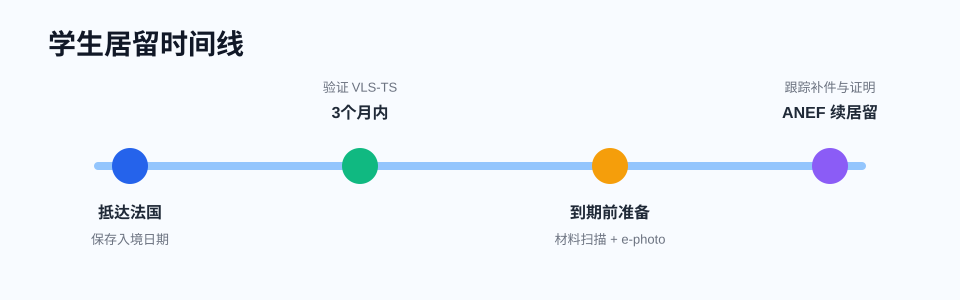

# 办理居留

在法国留学，合法居留状态由你的 **VLS-TS 学生签证验证证明** 或 **titre de séjour 学生居留卡** 支撑。第一年通常先验证 VLS-TS；之后继续留法学习，需要在 ANEF 平台申请续居留。

!!! danger "不要等到过期"
    居留续签不是“到期当天再办”。临近开学、巴黎大区、材料补件高峰都可能拖慢处理。建议到期前提前准备材料，并尽早在 ANEF 提交。

## 第一年：验证 VLS-TS

如果你持有的是 **Visa long séjour valant titre de séjour, mention étudiant**，抵达法国后需要在规定期限内在线验证。

- 平台：[Étrangers en France / ANEF](https://administration-etrangers-en-france.interieur.gouv.fr/)
- 时间：Campus France 和 Service-Public 均提示，抵法后最迟 **3 个月内**完成验证。
- 常用材料：护照、签证信息、入境日期、法国地址、有效邮箱、银行卡。
- 税费：以平台显示为准，学生 VLS-TS 常见为电子印花税。

验证完成后，系统会生成确认文件。请把 **护照签证页 + VLS-TS validation 确认 PDF** 一起保存；第一年很多行政手续都会要求它。

## 续居留：什么时候开始

如果你第二年继续在法国学习，需要在居留到期前通过 ANEF 申请学生居留卡。

建议节奏：

| 时间点 | 该做什么 |
|---|---|
| 到期前 4 个月 | 确认下一学年录取/注册、整理成绩单和住房证明 |
| 到期前 3 个月 | 拍 e-photo、准备资金证明、扫描旧居留和护照 |
| 到期前 2 个月 | 在 ANEF 提交申请并持续查看站内信 |
| 到期前后 | 如系统生成 prolongation / instruction 证明，下载保存 |

!!! note "材料不齐也要判断风险"
    如果只差新学年注册证明，可先向学校申请临时证明或说明信。是否能提交取决于 ANEF 当前表单和你所在地区处理规则；不要因为等待一份材料而让旧居留过期。

## 续居留材料清单

以 ANEF 当前要求为准，常见材料包括：

- 护照资料页、签证页、旧居留卡或 VLS-TS 验证证明。
- 近 3 个月住房证明：租房合同、房租收据、水电网账单、住宿证明等。
- e-photo 数字照片代码。
- 新学年的注册证明或录取证明。
- 上一学年的成绩单、出勤证明、实习证明等学习连续性材料。
- 资金证明：奖学金证明、银行流水、担保人资助证明等。Service-Public 当前学生资源标准为每月至少 **615€**，以官方页面更新为准。
- 如平台要求，补充健康保险、学校说明信或个人解释信。

### 住房证明怎么准备

ANEF 的学生居留材料清单中，常见可接受材料包括电、气、水、网络、固定或手机账单，租赁合同，房租收据，或 taxe d'habitation；住酒店、住朋友家也有额外证明要求。

## ANEF 里的几个状态

| 状态或文件 | 含义 | 你该做什么 |
|---|---|---|
| Attestation de dépôt | 你已提交申请 | 下载保存，不等于批准 |
| Demande de pièces complémentaires | 要求补材料 | 按期限补交，文件名写清楚 |
| Attestation de prolongation | 延长合法停留证明 | 保存 PDF，出行前确认是否允许返法 |
| Décision favorable | 原则批准 | 等短信/邮件通知取卡或后续缴税 |
| Titre disponible | 居留卡可领取 | 按通知预约或前往领取 |

!!! warning "旅行前先确认"
    只有某些证明可以支持离境后返法，且要看证明文字、旧居留状态和航空公司/边检执行。居留办理中如非必要，不建议安排法国境外旅行。

## 高频退件原因

- 住房证明超过 3 个月或地址和申请表不一致。
- e-photo 代码无效、已使用或照片不符合规格。
- 新学年注册证明缺失，只上传了录取邮件。
- 银行流水无法证明稳定资源，或担保说明没有签字和身份证明。
- 成绩单显示长期缺勤、挂科过多，但没有解释信。
- 文件模糊、边角缺失、把多个文件压成无法阅读的图片。

## 学业解释信怎么写

如果你换专业、重读、延期毕业、挂科较多或 gap 一段时间，建议准备一页法文解释信：

- 说明过去一年学习情况。
- 解释变动原因，不写情绪化内容。
- 强调下一学年的注册、课程安排和学习计划。
- 附上学校老师、项目负责人或实习单位证明更稳妥。

## 官方参考

- [ANEF / Étrangers en France](https://administration-etrangers-en-france.interieur.gouv.fr/)
- [Service-Public：外国学生在法国的 VLS-TS 与居留](https://www.service-public.gouv.fr/particuliers/vosdroits/F2231)
- [Campus France：抵法后验证长期签证](https://www.campusfrance.org/en/how-to-validate-your-long-stay-visa-visa-long-sejour-upon-your-arrival-in-france)
- [ANEF 学生居留材料清单 PDF](https://administration-etrangers-en-france.interieur.gouv.fr/particuliers/assets/docs/justificatifs-etudiant.pdf)
