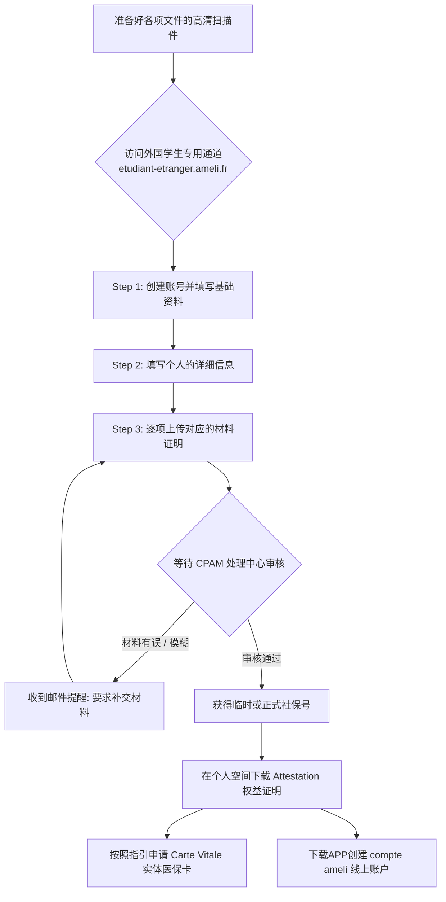

# Ameli 注册与健康保险

## 1. Ameli 是什么？为什么要办？

在法国，学生的基础医保属于 **Assurance Maladie（CPAM / Sécurité sociale）** 体系。尽早办理能够为你省下高昂的医疗费用。办理完成后你将会获得：

- **社保号（Numéro de sécurité sociale）**：通常会先发放临时号，审核完全通过后发放永久号。
- **权益证明（Attestation de droits）**：这代表你已正式受保，是看病报销、去药店开药必备的凭证。
- **医保卡（Carte Vitale）**：拿到权益证明后可申请绿色的实体医保卡。

!!! note "官方说明"
    国际学生入保必须走专门的学生平台 [etudiant-etranger.ameli.fr](https://etudiant-etranger.ameli.fr)，之后可在系统的个人空间下载证明并申请 Carte Vitale。

---

## 2. 申请入口（⚠️ 别走错网站！）

!!! failure "常见错误：走错本地人入口"
    很多新生直接搜索 “ameli.fr”，容易进到给**法国本地居民**使用的分支网站，在那里无论如何也找不到“首次来法学生注册”的通道。

✅ **正确入口（国际学生专用）**：[https://etudiant-etranger.ameli.fr](https://etudiant-etranger.ameli.fr)

---

## 3. 申请材料清单（最核心装备）

虽然不同省份/个人情况可能会有细微差别（比如可能被要求重新提交某一份翻译），但**通常必备**的是以下 5 项。请在开始申请前逐个打勾确认：

1. **身份证明**：护照首页（或其它包含照片和身份信息的有效证件）
2. **出生证明**：建议准备带父母详细信息的**出生公证双认证**或**驻法大使馆认可的宣誓译文**（常见退件重灾区，务必确保翻译达标）。
3. **在读证明**：当学年有效注册/在读证明（Attestation de scolarité / Inscription）。不能仅凭预录取通知书！
4. **居留/签证相关材料**：长期学生签证（VLS-TS）、已生效的居留卡（Titre de séjour）或 OFII 验证回执。
5. **银行账号信息**：法国银行开具的 RIB/IBAN（看病报销的钱直接打入此账户，极为重要）。

!!! warning "高频被拒提醒：扫描件质量"
    **所有上传的图片/PDF必须清晰且边角完整！**不要直接随意拍照。很多新生只是因为“照片边缘被裁切了1毫米”或“放大后字迹发虚”就被退回补件，白白耽误数月时间。

---

## 4. 线上通关全流程一览

为了让你对整个申请周期有一个宏观认识，我们为你梳理了这张流程全景图：

---

## 5. 线上申请核心步骤拆解

### Step 1｜创建账号与基础信息
进入 `etudiant-etranger.ameli.fr` 网站后：
- 在右上角选择你熟悉的语言界面（平台支持英文、法文、西班牙文等）。
- 按提示如实填写：是否在法工作（如果只是兼职通常选无影响）、出生日期、国籍等信息。

### Step 2｜填写个人资料（⚠️ 务必与材料完全一致）
一般会分为以下几个核心版块：
- **个人基本信息**
- **父母姓名**：**强烈建议完全照抄出生公证双认证（或宣誓译文）上的法文拼写**。字母顺序、拼音间断、大小写如有出入，极易被系统判定为两套不同的信息而遭退回。
- **法国住址**：请尽量填准确。此地址不仅用于行政审核，后续邮寄实体医保卡也会寄送到此地址。
- **联系方式**：通常建议预留法国的手机号码以便接收可能的手动核验短信。

### Step 3｜上传材料并确认
把你准备好的文件逐一上传到对应入口：
- 上传成功后，每项材料的后方会显示当前的处理状态，例如 “En cours de traitement”（处理中）或 “Conforme”（符合要求）。
- 如果系统提示你补交材料（比如“需要提供补充说明”），**按提示补交即可，这是大部分赴法新生的常态，不要慌乱。**

### Step 4｜等待审核拿证明
审核通过后，你可以在个人空间下载证明（Attestation de droits）。

!!! tip "对于处理速度的心理预期"
    各地 CPAM 的工作效率有着天壤之别（比如大巴黎地区通常较慢）。有人拿号只需三周，有人可能遇到拉锯战长达数月乃至大半年。这种“时间波动”很常见。只要系统里有你在办理记录，在此期间即使生病，去公立医院出示在办理的证明也能作为凭据，但最好还是备足常用药。

---

## 6. 拿到号之后，你还要做的两件事

### 6.1 申请 Carte Vitale（实体医保卡）
获得稳定的社保号和权益证明后，平台会向你发送申请 Carte Vitale 的指引（可能是线上上传专属照片，也可能是邮寄纸质表格给你填写后寄回附带照片）。拿到它后，你去各大药房买大部分处方药都可以免去垫付，直接刷卡结算。

!!! tip "拿卡小技巧"
    打电话给 Ameli 会加快拿卡进度，而且不必寄信。不要害怕说法语或者英语，小红书有完整教程。

### 6.2 注册“Compte Ameli”个人空间（必做）
千万不要以为收到社保号就万事大吉，你还要去申请一个个人专属的“Ameli 账户”：
- 用于随时在线下载自己最新的那份 **Attestation de droits**
- 追踪查看每一笔医疗费用的报销明细和进度
- 线上申报你的**主治医生（Médecin traitant）**。如果不申报主治医生，直接去专科看病，你的报销比例将会大幅度降低！
- 更新地址和汇款的银行 RIB。

---

## 7. 避坑指南：中国新生高频“触雷”区

!!! warning "雷区 1：出生证明不被认可"
    - 只提交了“无父母信息”的简版出生公证，这不符合法国开户要求。
    - 翻译件未经过法国正规途径认可，建议在国内办理**双认证**（外交部领事司+法国大使馆），或者来法国后找当地**上诉法院宣誓翻译员**重新翻译。

!!! warning "雷区 2：IBAN/RIB 乱填或填错"
    - 报销的钱只能打入你的银行账户。虽然有部分外省接受欧盟其它账户，但为了绝对稳妥和流程顺畅，强烈建议使用你在**法国本土银行**开具的 RIB（如 LCL, SG, BNP 等）。

!!! warning "雷区 3：名字拼音的组合方式"
    - 你的姓名（特别是复名包含空格或 hyphen 的情况）必须严格与护照扉页下方机读区的英文拼写对应。千万不要一会填 "Zhang San"，一会填 "Zhang Sanfeng"。

---

## 8. 最短版“新生通关清单”

1. **集齐装备**：护照 + 在读证明 + 包含父母信息的出生证明 + 长期签证/居留 + 法国RIB
2. **对准入口**：访问 [etudiant-etranger.ameli.fr](https://etudiant-etranger.ameli.fr) 注册账号
3. **上传等待**：对照清单上传高清全景扫描件，按需灵活补件
4. **下载凭证**：审核通过后第一步先存好 **Attestation**
5. **收尾工作**：按提示办出 **Carte Vitale**（医保卡）并绑定申报主治医生

---

## 9. 参考文献与官方入口备忘

- **Ameli 学生专属注册平台**：[etudiant-etranger.ameli.fr（唯一直达入口）](https://etudiant-etranger.ameli.fr)
- **Assurance Maladie 官方指南（国际学生流程）**：[ameli.fr 官方说明页](https://www.ameli.fr/assure/droits-demarches/etudes-stages/etudiant/vous-venez-etudier-en-france)
- **Étudiant-étranger 平台常见问题与文档帮助**：[Assistance 页面](https://etudiant-etranger.ameli.fr/espace/#/assistance)
- **Campus France 官方申请备忘录**：[法国高等教育署（含多种语言）](https://www.campusfrance.org/fr)
- **WillStudy 教程参考（含大量往期界面的实操截图对比）**：[WillStudy Ameli指南](https://www.willstudy.tw/securite-sociale/)