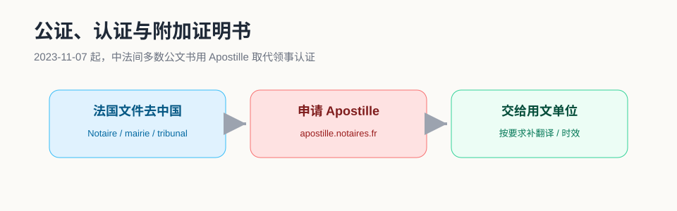

# 公证与认证

留学生最常遇到的文件问题包括：出生公证、无犯罪记录、委托书、学历材料、法国文书回国使用。这里最容易混淆的是 **公证、翻译、领事认证、附加证明书 Apostille** 这几个概念。

!!! success "关键变化"
    2023 年 11 月 7 日起，《取消外国公文书认证要求的公约》在中国与法国间生效。法国签发的公约范围内公文书，通常办理法国 **附加证明书 Apostille** 后即可送往中国内地及港澳地区使用，不再办理法国和中国驻法国使领馆的双认证。

## 先分清四个概念

| 名称 | 作用 | 常见场景 |
|---|---|---|
| 公证 / Notarisation | 证明某项事实、签名、文件副本或声明 | 出生、亲属关系、委托、声明 |
| 宣誓翻译 / Traduction assermentée | 由法国法院认可译员翻译 | 出生公证、成绩单、驾照等提交法国机构 |
| 领事认证 / Légalisation consulaire | 使领馆确认上一层签章真实 | 目前只适用于少数不适用 Apostille 的文书 |
| 附加证明书 / Apostille | 公约国家之间简化认证 | 法国文书去中国、中国文书去法国 |

!!! warning "Apostille 不证明内容真假"
    Apostille 只证明文书上最后一个签名、印鉴或身份属实，不代表用文单位一定接受文件内容。办理前要先问清楚学校、CAF、法院、国内单位对格式、时效、翻译语言的要求。

## 中国文件在法国使用

常见文件包括出生证明、亲属关系、无犯罪记录、学历学位、成绩单等。

建议路径：

1. 在中国办理对应公证书或主管机关出具的正式文书。
2. 按用文单位要求办理中国的附加证明书 Apostille。
3. 到法国后，如机构要求法文版，找 **traducteur assermenté** 做宣誓翻译。
4. 提交时同时保留中文原件、公证书、Apostille 和翻译件扫描件。

### 留学生最常用：出生公证

用于 Ameli、CAF、部分居留或婚姻手续时，建议准备：

- 含父母姓名的出生公证书。
- Apostille 或符合用文单位要求的认证。
- 法国宣誓翻译件。
- 电子扫描版，文件边角完整、文字清晰。

## 法国文件回中国使用

法国出具的公文书，如法国无犯罪证明、法国学历证明、法国结婚材料、法国法院/公证文件，通常走：

1. 先由法国主管机关、公证人、学校或法院出具正式文件。
2. 在 [apostille.notaires.fr](https://apostille.notaires.fr) 注册并提交 Apostille 申请。
3. 按提示邮寄或递交原件至受理的地区或跨省公证人公会。
4. 在线跟进、缴费并下载/打印电子附加证明书。
5. 按国内用文单位要求补做中文翻译。

!!! note "仍需双认证的例外"
    中国驻法国使馆说明：外交或领事人员制作的文书，以及直接处理商业或海关运作的文书，不适用《公约》相关规定，仍可能需要法国外交部和中国驻法国使领馆的“双认证”。

## 中国驻法使领馆公证

驻法使领馆可受理部分中国公民的声明、委托等公证事项，但不是所有事项都能在使领馆办理。涉及房产、继承、婚姻、诉讼等重大事项时，先向国内用文单位确认：

- 是否接受驻外使领馆公证。
- 是否必须本人到场。
- 是否需要中文固定格式。
- 是否可使用远程视频公证或签证中心渠道。

## 办理前的判断题

| 你手里的文件 | 要交给谁 | 通常该问什么 |
|---|---|---|
| 中国出生公证 | CAF / Ameli / 法国学校 | 是否需要 Apostille？是否必须宣誓翻译？ |
| 法国学校证明 | 国内单位 | 是否需要 Apostille？是否有时效要求？ |
| 授权国内亲友办事 | 国内房管、银行、法院 | 接受使领馆公证还是必须国内公证？ |
| 法国无犯罪证明 | 国内单位 | 是否要求原件、Apostille、中文翻译？ |

## 常见坑

### 只办了翻译，没有认证

翻译只解决语言问题，不解决“签章真实性”问题。需要 Apostille 的场景，翻译不能替代 Apostille。

### 用了普通翻译

法国行政机构常要求宣誓翻译。普通翻译公司、淘宝翻译或自己翻译未必被接受。

### 文件过期

无犯罪证明、单身证明、住房证明、银行证明等材料常有时效限制。用文单位可能只收 3 个月或 6 个月内文件。

### 没问清国内单位格式

国内不同城市、不同学校、不同银行要求差异很大。办理前先把样本发给用文单位确认，可以省掉大量返工。

## 官方参考

- [中国驻法国大使馆：领事认证和附加证明书](https://fr.china-embassy.gov.cn/chn/zgzfg/zgsg/lsqwc/lsrzhfjzms/202507/t20250716_11671919.htm)
- [法国 Apostille 申请平台](https://apostille.notaires.fr)
- [中国驻法国大使馆：联系我们](https://fr.china-embassy.gov.cn/chn/zgzfg/zgsg/lsqwc/lxwm/202507/t20250716_11671927.htm)
