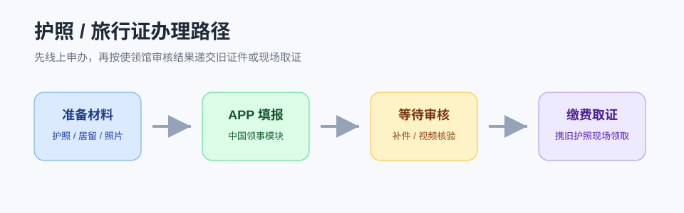

# 护照办理

在法国的中国公民办理普通护照、旅行证，通常通过 **“中国领事”APP** 提交申请。护照是你在法国办理居留、银行、租房、考试注册和回国旅行的核心身份证件，不建议等到临近过期才处理。

!!! warning "先看有效期"
    如果你下一次续居留、申请签证或买跨境机票时护照有效期不足，可能会被要求先换护照。建议在护照有效期剩 **12 个月左右** 时就开始规划换发。

## 什么时候需要办理

| 情况 | 应办业务 | 说明 |
|---|---|---|
| 护照即将过期 | 护照换发 | 留学生最常见情形 |
| 签证页快用完 | 护照换发 | 不要等到完全没有空白页 |
| 护照遗失、被盗、损毁 | 护照补发或旅行证 | 如需紧急回国，通常优先考虑旅行证 |
| 姓名、性别、出生日期等信息变化 | 护照换发 | 需准备相应证明材料 |
| 临时来法护照丢失且急需回国 | 应急旅行证 | 按使领馆要求补材料和核验身份 |

## 办理入口

- **中国领事 APP**：在应用商店搜索“中国领事”，注册并实名认证。
- **驻法使领馆信息**：[中国驻法国大使馆“关于中国领事 APP 的使用说明”](https://fr.china-embassy.gov.cn/sgxw/202105/t20210529_9037379.htm)
- **外交部护照/旅行证说明**：[中国领事服务网](https://www.mfa.gov.cn/wjbzwfwpt/byw/hzlxz/)

!!! tip "不要选错馆"
    APP 中需要选择拟办证使领馆。一般按你在法国的长期居住地选择所属馆区；如果不确定，先查看驻法使领馆官网的“联系我们”页面或电话咨询。

## 常用材料清单

具体材料以 APP 提示和使领馆审核意见为准，通常会涉及：

- 现持护照资料页、签证页或居留卡正反面。
- 法国居住证明：房屋合同、水电网账单、住房证明、学校住宿证明等。
- 近期电子证件照，需符合中国护照照片要求。
- 在法学习或居留状态证明：在读证明、注册证明、有效 VLS-TS 验证证明或居留卡。
- 个人声明或补充说明：如遗失、损毁、身份信息变化等情形。
- 未成年人申请还需监护人证件、关系证明及同意材料。

!!! warning "照片是高频退件点"
    护照照片必须白底、正面、无遮挡、无明显美颜或阴影。建议使用专业证件照服务，并保留电子版和纸质版。

## 办理流程

1. 下载并登录“中国领事”APP。
2. 进入“护照旅行证”模块，选择所在使领馆。
3. 按提示填写个人信息，在线签署国籍状况声明。
4. 上传护照、居留、照片和补充材料。
5. 等待初审。期间可能收到补件、视频见面或线下核验要求。
6. 审核通过后，按 APP 或使领馆通知递交旧护照、缴费并领取新证。
7. 领取后及时更新学校、银行、CAF、Ameli、运营商等账户中的证件信息。

!!! note "APP 办理的护照可能不含指纹"
    驻法使馆说明，通过“中国领事”APP申办的护照不包含申请人指纹信息；这不影响护照正常使用，但入境中国时可能需要走人工通道。

## 护照遗失或被盗怎么办

1. **先确认安全**：如涉及抢劫、暴力或人身威胁，先拨打法国报警电话 `17` 或欧洲紧急电话 `112`。
2. **报案并保留凭证**：到警局报失，保存 récépissé / déclaration de perte。
3. **联系使领馆**：通过“中国领事”APP或所属使领馆证件咨询渠道说明情况。
4. **判断是否急需回国**：不急用可申请补发护照；急需回国可咨询旅行证。
5. **同步处理居留风险**：护照丢失后，旧护照上的签证页也丢失，后续续居留时要准备报失证明和新护照。

## 常见问题

### Q：人在法国，可以回国换护照吗？

可以，但需要考虑法国居留、返法签证和时间成本。若你的法国居留卡或 VLS-TS 仍有效，回国换证后返法通常还要确保新旧护照、居留证明能对应使用。临近居留到期时不建议贸然离境。

### Q：护照换发会不会影响法国居留？

换发本身不取消居留，但你需要妥善保存旧护照和新护照。续居留、银行 KYC、学校注册时，可能需要同时出示旧护照上的签证记录和新护照。

### Q：可以代取吗？

以使领馆通知为准。驻法使馆说明中提到，取证时如由他人代取，通常还需代取人的身份证件；实际要求以 APP 取证单和现场通知为准。

## 办前检查

- [ ] 护照有效期是否足够覆盖下一次居留申请。
- [ ] 是否已下载“中国领事”APP并能完成实名认证。
- [ ] 电子证件照是否符合要求。
- [ ] 居留卡、VLS-TS 验证证明、住房证明是否清晰。
- [ ] 是否保存旧护照所有签证页和出入境记录扫描件。

## 官方参考

- [中国驻法国大使馆：中国领事 APP 使用说明](https://fr.china-embassy.gov.cn/sgxw/202105/t20210529_9037379.htm)
- [中国领事服务网：护照/旅行证](https://www.mfa.gov.cn/wjbzwfwpt/byw/hzlxz/)
- [中国驻法国大使馆：联系我们](https://fr.china-embassy.gov.cn/chn/zgzfg/zgsg/lsqwc/lxwm/202507/t20250716_11671927.htm)
