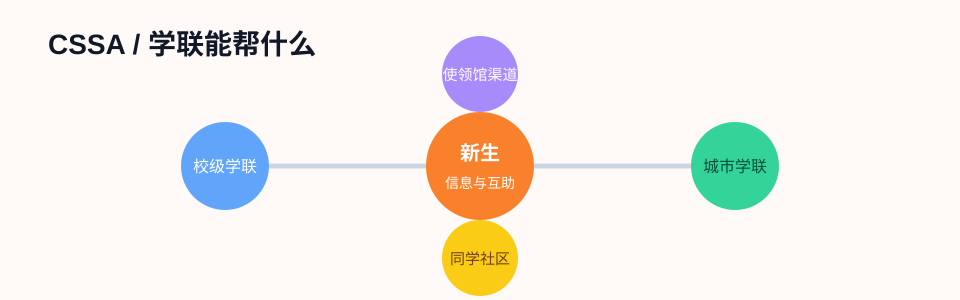

# 学联 (CSSA)

CSSA 通常指 Chinese Students and Scholars Association，即中国学生学者联谊会/联合会。在法国，常见层级包括校级学联、城市学联和全法学联相关网络。它们的价值在于信息互助、迎新、活动、二手资源和紧急互助线索。

!!! note "学联不是行政机关"
    学联可以提供经验和互助信息，但不能替代学校、警察、使领馆、律师、医生或法国行政机构。涉及居留、法律、医疗和人身安全时，要以官方渠道为准。

## 学联能帮什么

| 场景 | 可能提供的帮助 |
|---|---|
| 新生抵达 | 接机信息、临时住宿线索、入学群、城市指南 |
| 行政手续 | 分享 Ameli、CAF、居留、银行开户经验 |
| 生活互助 | 二手家具、搬家、找房提醒、交通建议 |
| 校园融入 | 新生见面会、文体活动、节日活动 |
| 学业与就业 | 讲座、校友分享、求职信息 |
| 突发情况 | 帮忙联系同学、提供翻译线索、指向使领馆或学校 |

## 怎么找到靠谱学联

- 学校官网的学生社团目录、BDE 或 international office。
- 学校中国学生群里由老生确认的官方二维码。
- 城市学联公众号、社交媒体或活动海报。
- 全法学联或使馆教育相关渠道发布的信息。
- 同专业、同宿舍、同城市老生推荐。

!!! warning "二维码也要核验"
    新生季会出现假群、广告群和诈骗群。进群后先看管理员身份、历史活动、是否与学校社团信息一致。不要因为“群里很多人”就直接相信收费服务。

## 加群后先做什么

- 改备注：学校、专业、年份，方便同学识别。
- 搜索群公告和历史消息，很多问题已经有人回答。
- 收藏城市常用信息：警局、医院、夜间药房、交通卡、学校国际处。
- 只在必要时私聊陌生人，不公开护照、居留、银行卡和住址。
- 二手交易尽量线下面交，贵重物品不要先全款转账。

## 学联信息怎么用

学联经验帖适合解决“我该从哪里开始”的问题，但具体执行前要二次确认：

| 信息类型 | 应该再核对哪里 |
|---|---|
| 居留材料 | ANEF、Service-Public、学校国际处 |
| CAF / Ameli | CAF、Ameli 官方网站 |
| 使领馆证件 | 中国驻法使领馆官网、中国领事 APP |
| 租房合同 | Service-Public、ADIL、学校 housing office |
| 法律纠纷 | 律师、法律援助、学校 juridique 服务 |
| 医疗问题 | 医生、药房、SSE/SSU、急救电话 |

## 常见风险

- **中介冒充学长学姐**：收费代办居留、CAF、租房，结果材料错误或失联。
- **转租不合法**：没有房东书面同意，后续 CAF、保险和押金都可能出问题。
- **二手交易诈骗**：提前转账后对方消失。
- **过度依赖经验帖**：法国政策和平台界面会变，旧攻略可能失效。
- **隐私泄露**：护照、居留、RIB、验证码不要发到群里。

## 遇到紧急情况

1. 先保障安全，拨打法国 `17`、`15`、`18` 或 `112`。
2. 联系学校 international office、宿舍前台或老师。
3. 通知可信同学或学联负责人协助沟通。
4. 中国公民需要领保时，联系驻法使领馆或 `12308`。
5. 保留证据：聊天记录、转账凭证、警局回执、医疗证明。

## 官方和参考入口

- [全法中国学者学生联合会旧版介绍](https://jiaoyuchu.online.fr/Subpages/UCECF.html)
- [中国驻法国大使馆：联系我们](https://fr.china-embassy.gov.cn/chn/zgzfg/zgsg/lsqwc/lxwm/202507/t20250716_11671927.htm)
- [Service-Public](https://www.service-public.fr/)
