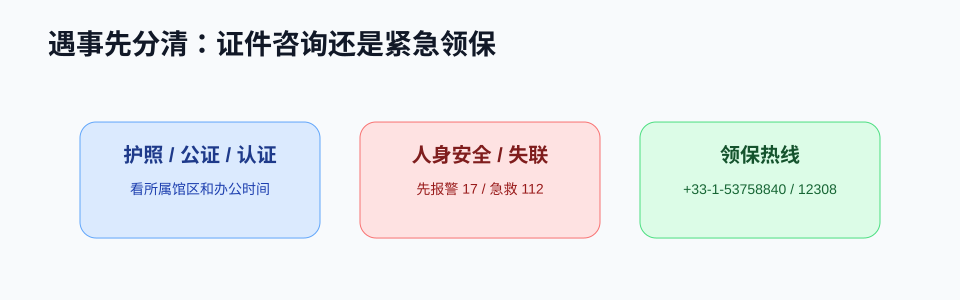

# 驻法使领馆

!!! abstract "速览"
    * **紧急先打法国救援**：危及人身安全的火灾、急病、暴行先拨 17/18/15/112，使领馆不能代出警或代行司法。
    * **24 小时领保热线**：遭遇人身拘禁、严重侵权等重大意外，拨打外交部 12308 或驻法使领馆领保电话。
    * **证件办理路径**：中国公民在法护照换发、旅行证申领主要通过“中国领事”APP 线上提交。
    * **领区划分**：巴黎本部、马赛总领馆、里昂总领馆及斯特拉斯堡总领馆各司领区，跨区办理前请先核对。

!!! danger "紧急情况先找法国应急系统"
    正在发生的人身伤害、抢劫、火灾、严重疾病等，请先拨打法国 `17`、`18`、`15` 或欧洲紧急电话 `112`（详见 [紧急求助](emergency.md)）。使领馆不能替代法国警察、消防、急救和法院。

## 驻法使领馆领事保护热线

中国公民在法遭遇重大突发意外、人身拘禁、严重侵权或失联失踪时，可向所在领区的使领馆申请领事保护与协助：

| 机构 | 24 小时领保电话 | 覆盖领区（主要城市） |
|---|---|---|
| **外交部全球领保热线** | `+86-10-12308` `+86-10-65612308` | 全球应急呼叫中心（北京） |
| **中国驻法国大使馆** | `+33-1-53758840` | 巴黎及直辖领区（法兰西岛、上法兰西、诺曼底等） |
| **中国驻马赛总领馆** | `+33-4-91320000` | 普罗旺斯、奥克西塔尼（**图卢兹**、蒙彼利埃）、科西嘉 |
| **中国驻里昂总领馆** | `+33-7-85620931` | 奥弗涅-罗讷-阿尔卑斯大区（**里昂**、格勒等） |
| **中国驻斯特拉斯堡总领馆** | `+33-6-09998464` | 大东部大区（**斯特拉斯堡**、梅斯、南锡等） |
| **中国驻圣但尼总领馆** | `+262-693925807` | 留尼汪海外省（La Réunion） |
| **中国驻帕皮提领事馆** | `+689-87223856` | 法属波利尼西亚（Polynésie française） |

## 办事分流与求助路径

中国驻法使领馆可以办理或协助处理护照旅行证、公证认证、领事保护等事项。遇到问题时，先判断是普通证件咨询、行政办理，还是人身安全紧急情况。

## 驻法机构概览

以下信息会变动，出发前务必查看官网最新通知。

| 机构 | 常见用途 | 地址或联系方式 |
|---|---|---|
| 中国驻法国大使馆本部 | 外交事务 | 20 Rue Monsieur, 75007 Paris |
| 驻法使馆领事侨务处 | 护照、旅行证、公证、认证等 | 11 Avenue George V, 75008 Paris |
| 驻马赛总领馆 | 南部地区证件和领事事务 | 16 Boulevard Carmagnole, 13008 Marseille |
| 驻里昂总领馆 | 东南部地区证件和领事事务 | 69 Rue Duquesne, 69006 Lyon |
| 驻斯特拉斯堡总领馆 | 东部地区证件和领事事务 | 4 Rue Eugène Carrière, 67000 Strasbourg |
| 驻圣但尼总领馆 | 留尼汪相关领事事务 | 50 Rue du Général de Gaulle, 97400 Saint-Denis |
| 驻帕皮提领事馆 | 法属波利尼西亚相关领事事务 | Punaauia, Polynésie française |
| 巴黎中国签证申请服务中心 | 普通签证、部分远程公证和商事认证 | 26 Rue Jacques Dulud, 92200 Neuilly-sur-Seine |

## 什么事找谁

| 事项 | 建议路径 |
|---|---|
| 护照换发、补发 | “中国领事”APP + 所属使领馆证件咨询 |
| 护照丢失急需回国 | 报警拿证明 + 联系使领馆咨询旅行证 |
| 法国文件回中国使用 | 先确认 Apostille 或认证路径 |
| 国内亲友授权委托 | 先问国内用文单位格式，再咨询使领馆公证 |
| 遭遇抢劫、暴力、失联 | 先报警/急救，再联系领保 |
| 被诈骗转账 | 立即联系银行止付、报警，保存证据 |
| 被拘留或涉诉 | 可要求联系中国使领馆，同时寻求律师 |

!!! note "领事保护能做什么"
    使领馆可提供信息、联系家属、协助与当地部门沟通、出具旅行证件等，但不能替你支付费用、介入司法判决、强制要求法国机构按你的要求处理。

## 护照丢失快速流程

1. 确认人身安全，必要时报警。
2. 到警局办理遗失或被盗声明。
3. 通过“中国领事”APP或电话联系所属使领馆。
4. 准备身份证明、居留证明、照片、报失材料。
5. 根据回国急迫程度申请旅行证或补发护照。
6. 后续续居留时保存报失证明、新旧证件关联材料。

## 防诈骗提醒

- 使领馆不会电话通知你卷入案件并要求转账。
- 不要把银行卡、验证码、护照扫描件发给陌生人。
- 来电显示可以伪造，如有疑问，挂断后主动拨打官网公布电话核实。
- “包办护照、公证、居留、解冻账户”的中介广告要谨慎。

## 官方参考

- [中国驻法国大使馆：联系我们](https://fr.china-embassy.gov.cn/chn/zgzfg/zgsg/lsqwc/lxwm/202507/t20250716_11671927.htm)
- [中国领事服务网：驻法国使领馆](https://cs.mfa.gov.cn/zggmcg/ljmdd/oz_652287/fg_653219/zggslg_653273/201109/t20110907_945616.shtml)
- [中国驻法国大使馆：来法中国公民安全指南](https://fr.china-embassy.gov.cn/zgzfg/zgsg/lsqwc/202603/P020260311608565029537.pdf)
