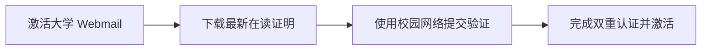

# AI 优惠与数字福利

!!! abstract "速览"
    * **银行特权**：Revolut 等数字银行在升级计划或迎新季中整合 Perplexity Pro 等高阶订阅特权。
    * **学生免费通道**：凭借法国高校分配的 edu 邮箱认证 GitHub Student Pack，免费解锁 GitHub Copilot。
    * **高校生态**：部分工程师院校及高商接入教育版 Google Workspace，支持深度体验内置 AI 协同。
    * **防扣费策略**：绑定各类试用（Free Trial）平台时，使用一次性虚拟银行卡，防止试用期满自动扣费。

在法国留学期间，充分利用学生身份与本地数字账户特权，可以免费或以极低成本获取市面上主流的人工智能助手与生产力工具。本篇为您梳理实用的 AI 工具优惠通道与申领指南。

---

## 银行与金融特权联动

### Revolut 联名数字特权

作为留学生常用的多币种数字账户，**[Revolut](https://www.revolut.com/)** 在其升级计划（Premium、Metal、Ultra）以及开学季专属迎新推广中，整合了多家顶级数字生活与 AI 工具订阅权益：

- **AI 工具会员赠送**：Revolut 与包括 **Perplexity Pro** 在内的多个 AI 及生产力平台建立了合作，符合资格的订阅用户可在 Revolut App 内的“订阅特权（Partnerships）”专区直接兑换高阶会员资格。
- **免额外订阅费**：特权包含在月费计划中，无需单独向第三方平台支付订阅费。
- **学生迎新活动**：每年 9~10 月开学季，Revolut 常联合高校或学生优惠网络推出限时免月费试用，试用期内即可同步激活包含的 AI 增值服务。

!!! tip "虚拟一次性卡防自动续费"
    在绑定各类免费试用（Free Trial）的 AI 平台时，推荐使用 Revolut 生成的**一次性虚拟卡（Virtual Disposable Card）**。此类卡片完成首笔 0 元扣费验证后卡号立即失效，可从根本上避免试用期结束后被平台意外自动扣款。

---

## 主流 AI 平台学生通道

### 1. GitHub Copilot（代码与学术写作助手）

微软与 GitHub 为全球在校学生免费提供原本售价 $10/月的 **GitHub Copilot**：

- **包含权益**：VS Code、JetBrains、Neovim 等 IDE 插件的实时代码生成、终端命令辅助、Copilot Chat 问答。
- **申请途径**：通过 **[GitHub Student Developer Pack](https://education.github.com/pack)** 认证。
- **认证材料**：法国大学分配的学生邮箱（如 `@univ-toulouse.fr`、`@etudiant...`），或上传当学年的法语在读证明（Certificat de scolarité）拍照件。
- **审核周期**：通常 1~3 个工作日内完成，有效期为 1~2 年，毕业前可每年重新验证续期。

### 2. Google Gemini & Google One AI

- **Google One AI Premium 试用**：Google 针对个人用户常年提供 1~2 个月的 Google One AI Premium（包含 Gemini Advanced 及 2TB 云存储）免费试用通道。
- **高校 Google Workspace 专享**：如果所在院校接入了 Google Workspace for Education（如部分工程师院校或高商），登录学校账号即可直接体验整合进 Google Docs、Gmail 与 Drive 的教育版 Gemini 功能。
- **教育优惠计划**：定期关注 Google 面向欧洲高校学生的官方活动，在高校网络环境下绑定新账户通常享有更长的免订阅期。

### 3. Perplexity Pro（学术检索与研报引擎）

Perplexity 是留学生撰写文献综述、查阅多语言学术资料的核心工具之一：

- **高校学生专属通道**：Perplexity 每年会开展全球高校迎新邀请活动，使用以 `.edu` 或欧洲大学域名后缀的官方学生邮箱注册，即可直接获赠数月乃至一整年的 **Perplexity Pro** 尊享会员。
- **核心价值**：支持在多家主流底座模型间切换，提供精确的学术论文来源索引与文件深度解析功能（具体可用模型以平台当前配置为准）。

### 4. Notion AI（学业管理与笔记排版）

- **Notion Plus 教育版**：所有在校留学生使用学校邮箱均可**永久免费**升级为 Notion Plus 个人方案（原价 $10/月）。
- **Notion AI 试用与特惠**：学生认证用户不仅享受无限制页面与团队协作，还可优先体验 Notion AI 的文本润色、摘要生成与多语言翻译辅助功能。

### 5. JetBrains AI Assistant

- **JetBrains 全家桶免费**：计算机、数据科学及工程类留学生可通过 **[JetBrains 学生授权](https://www.jetbrains.com/community/education/#students)** 免费使用 IntelliJ IDEA、PyCharm、CLion 等专业版开发环境。
- **AI 助手配额**：教育许可证用户可直接开启 IDE 内置的 JetBrains AI Assistant，享受代码补全与智能重构配额。

---

## 欧洲高校学生认证关键步骤

在申请上述 AI 学生特权时，请按照以下标准流程准备，以确保快速通过第三方验证平台（如 SheerID、UNiDAYS 或 GitHub Education）：

1. **激活学校官方 Webmail**：入学注册完成后，第一时间在学校 ENT（Environnement Numérique de Travail）系统激活官方提供的学生邮箱。
2. **下载当学年正规证明**：统一使用含有防伪验证码或二维码的 **Certificat de scolarité**（在读证明 PDF），不要使用未经盖章的简易录取函或学生证照片。
3. **姓名与学校完全一致**：认证时填写的英文字母姓名必须与护照及学校系统注册的名字完全吻合，学校名称建议输入法文全称（如 *Université Toulouse Capitole* 而非缩写）。
4. **日历设置取消提醒**：凡涉及绑定付款方式的试用优惠，激活后立即在手机日历设置“到期前 3 天提醒”，若后续不再使用可及时退订，保障个人资金安全。
