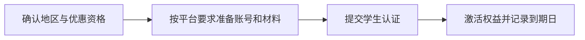

# AI 优惠与数字福利

!!! abstract "速览"
    * **Google 学生优惠**：法国符合条件的高校学生可领取 **Google AI Plus 12 个月免费试用**，含 **400 GB** 云存储，须在 **2026 年 12 月 31 日前**兑换。
    * **编程工具**：通过 GitHub Education 学生认证后，可免费激活 **Copilot Student**；模型由 Auto 自动选择，用量受方案限制。
    * **Canva 高校会员**：学校开通 **Canva Campus** 并授予访问权限后，可使用 Pro 与 Premium 工具。
    * **Joybuy 学生优惠**：法国站曾推出 **JoyPlus 学生价**；当前价格、认证条件与试用资格须在账户内确认。
    * **续费管理**：带付款方式的试用可能自动续费，须在订阅平台取消；一次性虚拟卡不适用于订阅付款。

学生优惠包括免费方案、限时试用、付费折扣和学校授权。申领前确认适用地区、账号类型、学生资格及到期价格。

**最后核验：2026 年 10 月 3 日。** 活动价格与资格以各平台官方入口及兑换页面为准。

---

## 银行与金融特权联动

### Revolut 联名数字特权

法国地区的 Revolut 付费方案包含部分数字订阅权益，各档方案所含会员不同：

- **AI 权益**：官方法国方案页中，**[Revolut Premium](https://www.revolut.com/fr-FR/revolut-premium/)** 列有 **Perplexity Pro**，**[Revolut Metal](https://www.revolut.com/fr-FR/metal/)** 列有 **12 个月 ChatGPT Go**，两档均含 **Lovable Lite**；领取资格与激活方式见 App 内对应权益及合作方条款。
- **升级前确认**：先查看自己的地区与方案包含哪些会员，再比较方案总费用和单独订阅费用。

!!! tip "试用订阅请用普通虚拟卡"
    Revolut 的**一次性虚拟卡（Carte virtuelle à usage unique）**每次付款后自动更换卡号，[官方说明](https://help.revolut.com/fr-FR/help/cards/card-issue/my-disposable-virtual-card-is-not-working/)其不能用于订阅、定期扣款和押金类付款。绑定免费试用（Free Trial）时使用普通虚拟卡，并在试用到期前到订阅平台取消续费。

!!! warning "虚拟银行资金安全提示"
    Revolut 属于立陶宛注册的线上数字银行（Neobank / 虚拟银行）。虽然其持有合规的欧盟银行牌照，理论上同样受到欧盟法定存款保险制度（EDIS 最高 10 万欧元保额）保护，但在实际使用中：
    - **切勿存放过多资金或大额生活费/学费**：由于缺乏线下实体网点，且线上风控体系对大额跨国资金极其敏感，容易触发系统自动合规审核导致账户被临时限制，人工处理周期往往较长；
    - **合理使用定位**：强烈建议仅将其作为日常小额消费、多币种换汇、境外刷卡以及绑定试用订阅的辅助账户；大额学费存款和重要行政报销（如 CAF 房补、Ameli 医保）务必优先存放在法国本土传统实体银行账户中。

---

## 主流 AI 平台学生通道

### 1. GitHub Copilot Student（编程助手）

通过 GitHub Education 认证的学生可免费领取 **Copilot Student**，用于代码补全、编程问答及开发任务辅助。

- **申请资格**：年满 **13 岁**，在授予学位或文凭的项目就读，并持有个人 GitHub 账号。
- **认证入口与材料**：进入 [GitHub Education benefits](https://github.com/settings/education/benefits)，选择 **Start an application**。可按要求提供带当前在读日期的学生证、课表、成绩单或 **Certificat de scolarité**（在读证明）。若系统要求学校邮箱，须先在 GitHub 账号中添加并验证该邮箱。详见[官方学生申请指南](https://docs.github.com/en/education/about-github-education/github-education-for-students/apply-to-github-education-as-a-student)。
- **激活会员**：认证获批后，在权益页选择 **Learn more** 并按提示激活 Copilot Student。认证批准和会员激活是两个步骤，权益同步可能需要数天。详见[学生免费激活说明](https://docs.github.com/en/copilot/how-tos/copilot-on-github/set-up-copilot/enable-copilot/set-up-for-students)。
- **模型与额度**：学生方案使用 **Auto 自动选择模型**，有方案规定的 AI 用量额度。详见[Copilot 方案对照](https://docs.github.com/en/copilot/get-started/plans)及[模型选择规则](https://github.blog/changelog/2026-06-24-changes-to-model-selection-for-free-and-student-plans/)。
- **资格维护**：GitHub 每月重新评估学生资格，按账户提示补充认证材料。

### 2. Google Gemini & Google One AI

- **法国免费学生活动**：当前提供 **Google AI Plus 12 个月免费试用**，包含 **400 GB** 云存储及更高的 Gemini 使用额度，可从 [Google 法国学生优惠入口](https://gemini.google/fr/students/?hl=fr)申领。新用户及 2025 年 AI Pro 试用已到期的学生可按资格申请。
- **申请条件**：年满 **18 岁**、在支持地区的高校就读，通过 **SheerID** 学生认证，使用**个人 Google 账号**并提供有效付款方式。家庭组成员等账号限制见[学生优惠条款](https://one.google.com/offer/studentoffer8?g1_landing_page=0)。该活动须使用个人账号申领，学校发放的 Workspace for Education 账号不适用。
- **期限与续费**：须在 **2026 年 12 月 31 日前**兑换；免费期从兑换日起计算。法国活动页标示到期后自动按 **4.99 €/月**续费，须在免费期结束前取消才能避免后续扣款。
- **AI Pro 学生方案**：[Google One 学生帮助](https://support.google.com/googleone/answer/17422238?hl=fr)另列有两项付费学生方案：**折扣价 Google AI Pro**，以及 **AI Pro + YouTube Premium 学生套装**，在读期间最长可连续使用 4 年。两者均须通过 SheerID 认证，开放地区与价格见对应兑换页。
- **学校 Workspace 权益**：学校账号内的 Gmail、Docs、Drive 等 Gemini 功能取决于学校购买的版本、许可证及管理员设置，可向学校 IT 服务确认。详见[Google 教育账号功能说明](https://support.google.com/drive/answer/13952129?co=DASHER._Family%3DEducation&hl=fr)。

### 3. Perplexity Pro（学术检索与研报引擎）

Perplexity 可用于检索资料、查阅引用来源及辅助整理文献。

- **学生折扣**：**Education Pro** 面向通过认证的学生和教育工作者提供付费优惠，金额以结账页为准。
- **申请方法**：可用个人或学校邮箱注册，在升级菜单选择 **Education** → **Verify as student**，完成 SheerID 认证。详见[Education Pro 官方说明](https://www.perplexity.ai/help-center/zh-CN/articles/12590157-shen-me-shi-education-pro)。
- **已有会员权益**：如果自己的 Revolut 方案包含 Perplexity Pro，可先查看领取条件，避免重复订阅。

### 4. Notion（学业管理与笔记排版）

- **免费教育方案**：认可高校的学生可用学校邮箱申请个人 **Education Plan**，适用于**单成员工作区**，包括最多 100 位访客、无限文件上传及 30 天页面历史。
- **认证与续期**：学校邮箱须是 Notion 账号的主邮箱，每年重新验证；无法继续验证时，工作区转为 Free 方案。详见[Notion 教育方案与资格](https://www.notion.com/help/notion-for-education)。
- **AI 功能**：Free 与 Plus 方案提供有限的 AI 体验额度；完整 Notion AI 包含在 Business 与 Enterprise 中。详见[Notion AI 常见问题](https://www.notion.com/help/notion-ai-faqs)。

### 5. JetBrains AI Assistant

- **免费开发工具**：符合资格的学生可通过 [JetBrains Student Pack](https://www.jetbrains.com/academy/student-pack/)免费使用专业开发工具，用于非商业教育用途；学生授权每年续期。
- **认证方式**：按申请页要求使用大学邮箱、ISIC/ITIC 或 GitHub Student Developer Pack 等认证方式。
- **AI 权益**：教育授权可使用 **AI Free**；兼容版本可提供 **30 天 AI Trial**，长期 AI Pro 与 AI Ultimate 须另行订阅。详见[教育授权中的 AI 方案说明](https://youtrack.jetbrains.com/articles/SUPPORT-A-395)。

### 6. Canva（演示文稿、简历与设计）

- **大学生会员通道**：如果学校开通 **Canva Campus**，获得学校授权的学生可免费使用 Pro 与 Premium 工具；访问权限由学校管理。
- **查询方式**：尝试用学校邮箱登录 Canva，或向学校 IT 服务、学生事务部门询问 Campus 授权及加入方式。
- **方案区别**：**Canva Education** 免费方案面向符合条件的中小学教师及受邀学生；高校学生通过学校的 Campus 方案领取对应权益，也可使用个人 Canva Free。
- **毕业前保存作品**：学校账号或授权结束前，将需要保留的设计复制到个人账号。

官方入口：[Canva 法国学生会员与资格说明](https://www.canva.com/fr_fr/education/etudiants/)。

---

## 购物会员学生优惠

### Joybuy JoyPlus 学生会员

- **法国学生优惠**：Joybuy 在 **2026 年 3 月 16 日上线公告**中公布过 **2.99 €/月**学生价。该价格属于上线活动价，当前学生价格、认证方式与可领取优惠须在 [JoyPlus 会员页](https://www.joybuy.fr/membership)或法国站 App 内确认。来源：[Joybuy 法国上线公告](https://about.joybuy.com/fr/joybuy-arrive-en-france/)。
- **会员权益**：符合条件的 Joybuy 自营商品可享会员免费配送、专属优惠及积分；查看商品页的 **Vendu et expédié par Joybuy**（由 Joybuy 销售并配送）标识及活动条件。
- **免费试用**：法国站提供符合资格的新用户 **30 天免费试用**；会员须年满 **18 岁**，试用通常每位用户仅限一次。
- **续费与取消**：试用结束自动转为付费会员，月付或年付方案自动续期。可在 JoyPlus 会员管理页关闭下一期自动续费，办理前核对下次扣款日期。

官方规则：[JoyPlus 法国会员条款](https://www.joybuy.fr/help/joybuy-plus-terms)。

---

## 欧洲高校学生认证关键步骤

各平台接受的账号与证明材料不同，申请时按对应入口的要求准备：

```mermaid
graph LR
    A[确认地区与优惠资格] --> B[按平台要求准备账号和材料]
    B --> C[提交学生认证]
    C --> D[激活权益并记录到期日]
```

1. **激活学校邮箱**：在学校 ENT（Environnement Numérique de Travail）系统激活 Webmail，保留收取认证邮件的权限。法国学校邮箱使用各自域名，认证时选择平台认可的学校。
2. **按平台准备材料**：下载当学年的 **Certificat de scolarité**（在读证明）；GitHub 也接受符合要求的学生证、课表或成绩单。Notion 个人教育方案须使用学校邮箱认证。
3. **核对账户信息**：按表单要求填写姓名、学校与在读信息；Google 学生活动使用个人 Google 账号，Canva Campus 按学校提供的账号或邀请方式加入。
4. **记录到期与续费日期**：带付款方式的试用可设置到期前 3 天提醒；不再使用时在原购买平台取消续费，并保存取消确认。
