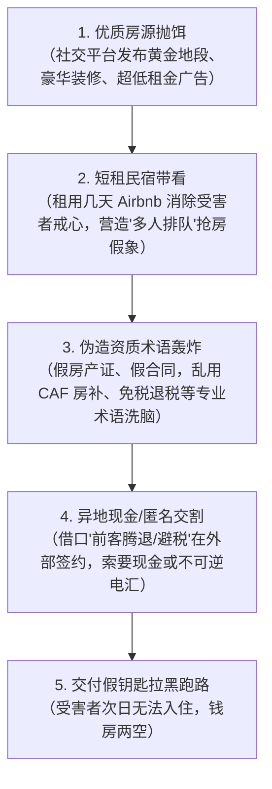
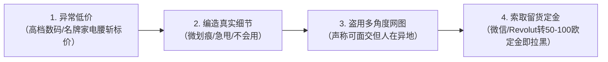
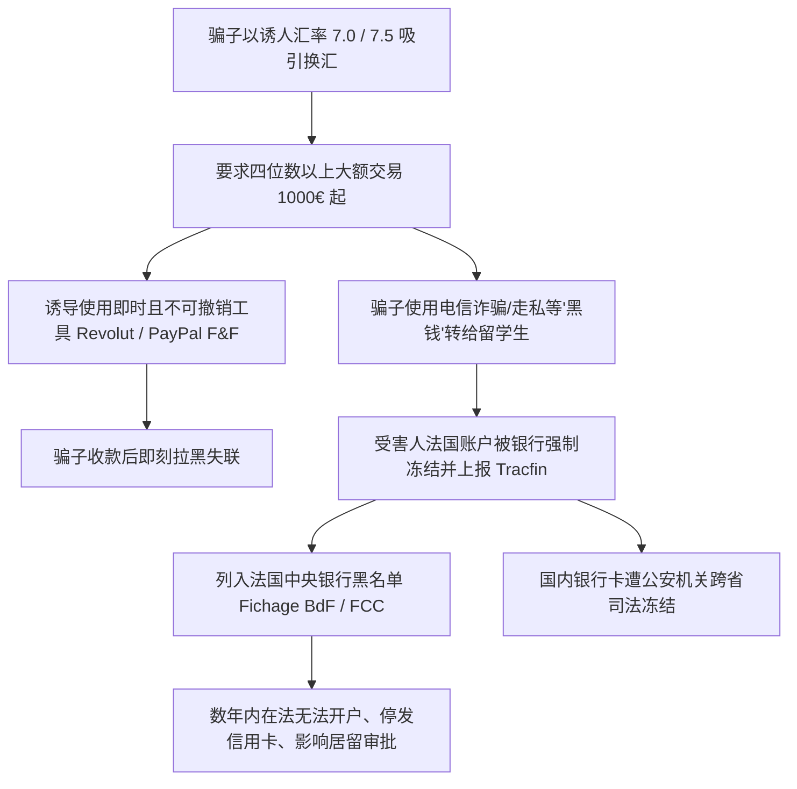
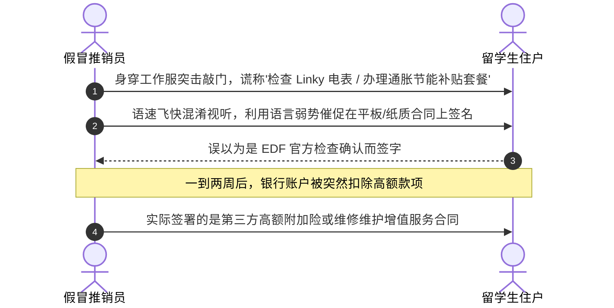
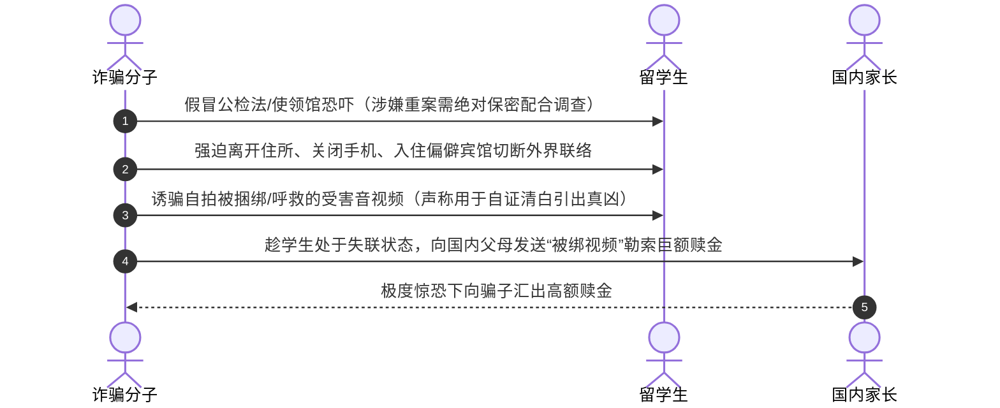
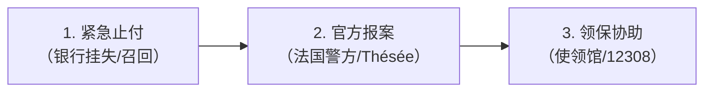

# 留法生活反诈防骗提醒指南

在异国他乡求学，海外生活的安全与合法合规是顺利完成学业的基石。近年来，针对在法中国留学生的诈骗手法不断翻新演变，从早期的冒充公检法电信诈骗，延伸到**短租民宿冒充实地看房收取现金押金**、**社交平台潜伏“杀熟”转卖假二手与私下换汇洗钱**、**冒充法国电力公司（EDF）上门诱导签署高额附加合同**，乃至恶性的**“虚拟绑架”勒索**。

本指南由图卢兹学联（UCECF-ST）与全法学联真实案例总结，结合法国法律法规与公共服务常识编写，旨在帮助广大同学擦亮双眼，筑牢反诈防线。

!!! abstract "速览与防骗核心底线"
    * **终极原则（一不汇）**：凡是陌生人或未经法定资质核验，要求转账汇款、缴纳“保证金”、“安全账户”、“看房预约金”或“现金大额押金”者，**坚决不汇**。
    * **公职铁律（四不会）**：中法使领馆与公检法机关**绝不**电话通知涉案转账、**绝不**电话催领包裹公文、**绝不**在社交软件（微信/Telegram/WhatsApp）办案发通缉令、**绝不**设立所谓“资金安全账户”。
    * **租房红线**：实地看房仍需核验**房东产权证明（Titre de propriété）**；签署正规租约（Bail）前严禁付款；上传租房材料务必使用法国政府 **DossierFacile** 添加防伪水印。
    * **换汇与二手**：私下换汇属中法两国外汇管制法规**明令禁止的非法行为**，极易卷入黑钱洗钱导致法国银行账户强制注销并列入央行黑名单（Fichage BdF）；二手交易坚守同城当面验货。
    * **受骗救济**：第一时间致电银行挂失止付（Opposition），前往当地警察局报案（Déposer plainte）或登录法国国家反诈平台 **Thésée**，并联系外交部全球领保热线 **+86-10-12308**。

---

## 一、租房诈骗：实地看房仍踩坑的升级套路 {#housing-fraud}
## 真实案例还原：短租民宿冒充长租房

!!! danger "全法学联真实案例通报"
    留学生小白在社交平台相中一套位于市中心、地段极佳、租金适中的优质公寓。为确保稳妥，小白主动联系“房东”并约定线下实地看房。
    
    看房当天，房屋真实存在且精装完备，“房东”表现得极为亲切热情，小白非常满意。但在后续签约环节，“房东”以**“目前屋内还有短期租客在住腾退，不便在房内交割”**以及**“为了帮双方合理避税省钱”**为由，约小白在公寓附近的咖啡馆签署了纸质租房合同，并要求小白**当场以现金支付相当于 3 个月租金的押金与首期租金**。“房东”随即交付了房屋钥匙。
    
    次日小白携带行李搬家入住时，才震惊发现钥匙根本无法拧开门锁；联系公寓物业后方知：**该套房屋是诈骗分子在短租平台（如 Airbnb / Booking）上仅预订了数日的民宿**。“房东”身份、房产资质与租房合同全部系伪造，此时骗子已拉黑跑路，导致小白遭受数千欧元的惨重经济损失并流落街头。

---

## 诈骗分子的四步作案链条

1. **优质房源抛饵引流**：在小红书、微信群或房屋交易网站发布位置极佳、采光一流、租金明显低于市价的“梦中情房”，迅速吸引急于落脚的新生。
2. **实地看房去疑取信**：骗子要么以“人在外地不便出面”、“委托朋友代看”推脱，要么直接租下几天民宿亲自带看，并在看房过程中刻意透露“还有好几拨学生排队交定金”，制造心理压迫感。
3. **包装流程专业洗脑**：精心伪造法国标准租赁合同（Bail de location），熟练使用 CAF 房补、担保人、杂费包干（Charges comprises）等专业词汇，使初来乍到的新生深信其为合法正规房东。
4. **异地交割现金与不可逆汇款**：以“短期房客未搬走”、“正在做最后清洁”、“帮双方避税”为借口不在房内交易，坚决要求使用**现金**、**西联汇款（Western Union）**、**MoneyGram** 或充值卡（如 Transcash, Neosurf, PCS Mastercard）等匿名性极高、无法撤销的方式付款。

---

## 租房资质核验对照标准

在签署合同或交付资金前，请严格对照下表进行资质核查：

| 校验环节 | 正规合法流程与证明文件 | 诈骗与侵权典型破绽 |
|---|---|---|
| **房东身份核验** | 房东主动出具法定身份证件（Carte nationale d'identité / Passeport）原件并允许拍照留存。 | 自称身在国外、生病、家中急事，仅出示模糊扫描件或委托无资质第三方。可在 LinkedIn、Facebook 搜索房东姓名核实背景。 |
| **房屋产权证明** | 出具房屋所有权证明（**Titre de propriété**）、近期地税单（**Avis de taxe foncière**）或近 3 个月电费单（**Facture EDF / Justificatif de domicile**）。 | 无法提供房屋产权凭据，以“隐私”为借口推脱，或出示明显经 PS 篡改的文档。 |
| **中介/代理资质** | 正规中介具备不动产职业执业证书（Carte professionnelle）与实体门面；私人代管必须出示房东亲笔签名的**法定委托书（Procuration / Mandat de gestion）**及房东身份证复印件。 | 无营业执照实体店，仅通过私人微信联系，无法提供具有法律效力的房东书面委托书。 |
| **现租客带看转租** | 法国常见由即将退房的现租客协助带看，但**现租客绝对无权签署合同或代收任何款项**；承租人转租（Sous-location）必须出示大房东书面转租许可（**Accord écrit du bailleur**）。 | 现租客私下口头转租并要求将押金转至个人账户。私下转租属非法违约行为，租客随时面临驱逐且无法申请 CAF 房补。 |
| **付款与押金方式** | 严格通过法国或欧盟银行转账（Virement bancaire）或支票支付；收款人账户名须与合同签署人姓名**严格一致**。 | 坚决要求支付大额**现金**、西联汇款、加密货币，或转账至境外无关个人账户。 |

---

## 租房防骗实操关键手段

### 1. 法定看房权与禁止预先收费
根据法国《住宅与租赁法》（Loi Alur 等法规），在双方签署正式租赁合同（Bail）之前，**租客有权免费看房，任何房东或中介严禁收取“留房定金（Frais de réservation）”、“预约金”或“看房材料审查费”**。凡是在看房前要求以任何名义转账者，100% 为诈骗。

### 2. 材料防盗用水印（DossierFacile）
向中介或房东递交租房材料包（Dossier）前，**务必使用法国生态转型部官方平台 [DossierFacile.logement.gouv.fr](https://www.dossierfacile.logement.gouv.fr/)**。
* **公共免费服务**：该平台由法国政府官方运营；
* **防伪水印防护**：上传护照、居留卡、在读证明、税单、银行流水后，系统会自动在所有文档上生成不可去除的官方水印（例如 *Document exclusivement dédié à la location immobilière*）；
* **彻底杜绝被盗**：严防不法分子将您的护照和流水盗用于冒名申请消费贷款、开设虚假空壳账户或洗钱犯罪。

### 3. 反向搜图识别网图
真实房源往往存在细微瑕疵（采光、朝向、家具成色）。对社交媒体发布的豪华精装、地段优越且低租金的“完美房源”，使用 Google 图片或百度识图进行“反向图片搜索（Recherche inversée d'images）”，往往能直接发现盗用自 Airbnb 民宿或房产设计网站的样板间网图。

### 4. 法定押金上限与支付渠道
* **空房租赁（Location nue）**：押金最高不得超过 **1 个月不含杂费裸租金**；
* **家具房租赁（Location meublée）**：押金最高不得超过 **2 个月不含杂费裸租金**；
* **机动性租约（Bail mobilité）**：法国法律明文规定房东**不得要求任何押金**；
* **支付方式底线**：必须通过银行转账（Virement）或支票，核对账户名与合同签署人一致，拒绝现金。

### 5. 现场交割与钥匙门禁当面测试
* **进门房屋状况清单（État des lieux d'entrée）**：入住当天必须与房东共同逐项检查房屋各处，记录所有破损并双方签字拍照存档；
* **当面测试所有钥匙与门禁**：必须当着房东的面，逐一插入钥匙测试公寓入户防盗门锁，测试单元大门门禁代码（Digicode）与感应磁卡（Badge）是否顺畅有效；
* **结伴看房**：初到法国的新生与女同学，看房与签约建议结伴前往，安全第一。

---

## 遭遇租房诈骗紧急救济

若不幸遭遇假房东或被骗押金，请按以下步骤紧急维权：

1. **银行紧急拦截（Recall）**：若通过银行转账，立即致电开户行客服要求启动**转账紧急召回程序（Rappel de virement / Recall）**；
2. **警方现场立案报案（Déposer plainte）**：携带租房合同、假钥匙、聊天记录、付款凭证及房东信息，前往最近的法国国家警察局（Commissariat de Police）或宪兵队（Brigade de Gendarmerie）正式报案，**索取立案证明回执（Récépissé de dépôt de plainte）**；
3. **法国国家网络反诈平台报案**：登录法国官方平台 👉 **[Thésée - Service-Public.fr](https://www.service-public.fr/particuliers/vosdroits/R62200)** 进行在线网络诈骗报案；
4. **领事保护协助**：遭遇人身侵害或需要协助，联系外交部全球领保应急热线 ☎ **+86-10-12308** 或中国驻法使领馆。

---

## 二、二手交易与私下换汇陷阱 {#exchange-fraud}

## 一、二手交易“潜伏杀熟”模式与防范

诈骗分子通常伪装成初入法国的新生，通过各大留学公众号、新生答疑贴加入各大城市学联群、租房转租群、二手闲置群。

入群后，骗子会先潜伏数周，在群里热心参与互动打消群友顾虑；随后在毕业离校或开学采购的高峰节点，密集发布【低价出闲置二手数码/家电】信息。

### 二手交易诈骗四大典型特征

1. **虚构低价利用“捡漏”心理**：发布 iPad、MacBook、戴森吹风机、微单相机或高级电饭煲等抢手商品，标价明显低于二手市场合理残值；
2. **刻意编造细节掩人耳目**：文案中刻意标注“表面微划痕”、“仅用过一学期回国急出”、“功能完好不会使用才转让”，以此打消买家对低价的疑虑；
3. **盗取网络多角度实拍图**：图片展示详尽，甚至附带包装盒与发票网图，主动声称“支持线下当面交易”，给买家留下诚信负责的假象；
4. **索取“留货定金”**：当受害人表达购买意向后，骗子谎称“咨询的人极多，谁先付定金留给谁”，要求通过微信、支付宝或 Revolut 先转 50–100 欧定金，款项一到账即刻拉黑退群。

!!! tip "二手交易防范策略"
    * **严格同城当面交接**：同城二手买卖坚决遵循**“线下当面验货、现场开机测试、确认无误后再付款”**的铁律。
    * **未验货绝不付定金**：未亲手检验到实物之前，任凭对方以何种理由催促，坚决不支付任何形式的定金或全款。
    * **群组管理警惕陌生人**：群主与群友不随意邀请无身份认证的陌生账号入群，发现群内异常低价出物账号及时向管理员举报踢出。

---

## 二、私下换汇的致命法律与金融风险

部分同学为了省去银行跨境汇款手续费或贪图所谓“超优汇率”，选择在微信群、朋友圈与私人换汇。私下换汇不仅潜藏极高诈骗风险，更触碰中法两国的法律红线：

### 1. 虚假超优汇率与不可撤销转账陷阱
* **超优汇率诱饵**：利用留学生对汇率波动的敏感心态，报出明显背离官方外汇牌价的诱惑汇率（例如实时官方汇率 7.8 时，骗子报出 7.0 或 7.5）；
* **大额交易要求**：骗子通常只接四位数（1000 欧元以上）甚至更高金额的大额兑换；
* **不可撤销支付手段**：骗子通常诱导受害人使用 **Revolut**、**PayPal（以 Friends & Family 亲友转账模式）**、**Wise** 或即时国际电汇转账。**请注意：PayPal 的“亲友模式（Friends and Family）”没有任何商业买家保护政策（Protection des Achats），Revolut 点对点转账一经发送亦无法撤销或申诉退回**。

### 2. 触犯中法外汇与反洗钱法律红线
* **非法买卖外汇定性**：根据中国《外汇管理条例》及法国《货币与金融法典》（Code monétaire et financier），**任何个人在非指定合法金融机构私下买卖外汇，均属非法买卖外汇或非法从事资金结算的违法行为**；
* **被动卷入洗钱与电信诈骗“黑钱”**：骗子打给你的资金，绝大多数是跨境网络赌博、电信诈骗、走私贩毒洗钱的“涉案赃款”。一旦你的账户接收此类资金，**法国银行系统会自动触发反洗钱监控（Tracfin），立即强制冻结甚至注销你的银行账户**；
* **列入法国中央银行黑名单（Fichage BdF）**：涉案个人会被登记在法国中央银行不良金融记录库（Fichier Central des Chèques, FCC / FICP），面临长达数年内**在全法国任何商业银行均无法开设账户、无法使用支票、无法申请银行卡**的严重信用惩戒，直接波及日常留学生活甚至影响学生居留（Titre de séjour）的续签换发；
* **国内银行卡连带冻结**：涉及洗钱赃款的国内关联银行账户，会被国内公安机关直接执行**跨省异地司法冻结（民事/刑事冻结）**，解冻流程繁复且当事人须接受公安机关调查自证清白；
* **遭遇诈骗难以立案维权**：由于私下换汇本身属于违法违规交易，一旦资金被骗，司法机关往往难以按普通民事经济纠纷立案挽损，当事人甚至可能面临被追究非法换汇法律责任的风险。

!!! danger "换汇安全底线"
    **换汇必须且只能通过正规持牌金融机构**（如中国国内各大银行官方手机银行 App 购汇并正规电汇至法国银行卡，或在法国本地实体银行网点办理），切勿贪图蝇头小利私下换汇！

---

## 遭遇交易诈骗后的处置流程

1. **紧急挂失与召回**：
   * 银行卡被盗用：立即拨打法国银行卡 24 小时统一挂失热线 ☎ **0892 705 705**；
   * 银行电汇欺诈：第一时间联系发卡行要求启动**紧急召回（Recall de virement）**。
2. **司法报案与存证（Déposer plainte）**：
   * 保存完整的微信聊天记录、转账凭证、收款人信息，前往当地警察局或宪兵队报案，**索取立案证明回执（Récépissé de dépôt de plainte）**；
   * 登录法国国家网络欺诈报警系统 👉 **[Thésée - Service-Public.fr](https://www.service-public.fr/particuliers/vosdroits/R62200)** 提交网络交易欺诈举报。
3. **向平台与使领馆求助**：
   * 向微信团队或支付机构举报诈骗账号；
   * 如遇巨额损失或人身安全受到威胁，拨打外交部全球领保热线 ☎ **+86-10-12308**。

---

## 三、冒充机构与上门敲诈欺诈 {#telecom-fraud}

      4. 国内公检法机关**绝不会**要求向所谓“安全账户”或个人账户汇款，司法体系内根本不存在任何“资金审查安全账户”！

---

## 一、冒充机构与上门敲诈欺诈

### 1. 冒充 EDF 电力公司上门推销附加服务合同

近年来，法媒《巴黎人报》（Le Parisien）暗访曝光了席卷全法的“假电工推销骗局”（Démarchage à domicile abusif）：

1. **伪装身份突击敲门**：身着类似法国电力公司（EDF）蓝色工装的推销人员直接敲响公寓房门，自称“EDF 电表检测员”，以“例行检查电表（Compteur Linky）”或“应对能源通胀，协助住户办理政府节能补贴与优惠电费新套餐”为名进门。
2. **利用语言劣势诱导签名**：在简单查看电表后，推销员迅速拿出纸质合同或平板电脑催促受害者签字，语速极快地声称“这只是确认今天完成检查的手续，新套餐每月可省一大笔电费”。很多外籍留学生由于法语合同术语较多且碍于情面，未仔细逐字阅读便签下名字。
3. **高额扣费与解约陷阱**：一到两周后，受害人银行账户突然被扣除大笔费用。经核实才发现，当时签的根本不是 EDF 的电费打折协议，而是第三方经纪公司捆绑的**高额附加险或无意义的维修维护增值合同（Contrat de maintenance / Assurance dépannage）**。由于合同是当事人亲笔签名且常被推销员拖延错过法定 14 天无条件撤回反悔期（Délai de rétractation），事后申诉退费与解约流程极为艰难。

!!! warning "EDF 官方核验铁律与邮件白名单"
    * **EDF 绝不无预约直接敲门**：EDF 的电表巡检或技术维护均由法国电网管理公司 **Enedis** 执行，且**必须事先通过公寓物业在门厅张贴公告，或提前通过短信/信件与住户确认预约时间**，绝对不会未通报直接上门敲门。
    * **EDF 绝不需要向住户索要电表号**：EDF 内部数据库已严格备案并绑定了住户的电表交付点编号（PDL / PRM），凡是进门索要电表号抄录者，100% 为商业推销人员。
    * **EDF 绝不推销特定产品**：EDF 官方合作伙伴仅提供正规技术安装，绝不会主动上门向个人推销特定品牌的太阳能板或家用电器。
    * **EDF 绝不上门索取银行卡**：EDF 官方绝不会在上门时向住户索取银行卡账号、CVV 码或要求在便携式 POS 机刷卡。
    * **EDF 官方合法电子邮件域白名单**（除下列域名外，其余类似拼写的发件人均为高仿钓鱼邮件）：
      - `@edf.com`、`@edf.fr`、`@service-client-edf.fr`
      - `@relation-clients-edf.fr`、`@info-client-edf.fr`、`@informations-edf.fr`
      - `@communication-edf.fr`、`@souscrire-edf.fr`、`@tempo-edf.fr`
      - `@ejp-edf.fr`、`@economiedenergie.fr`、`@mandat-edf.com`

### 2. 假冒消防员日历募捐（Calendriers des sapeurs-pompiers）

每年 11 月中旬至 12 月底，法国全境有消防员上门向居民赠送新年日历并接受自愿慰问募捐（Tradition des étrennes）的历史传统。不法分子往往在此期间伪造消防制服上门骗取现金。

* **识别真假消防员关键要点**：
  * **正式勤务制服**：正规上门消防员必须身着统一的深蓝色消防勤务常服（Tenue de service），佩戴正规消防军衔胸章；
  * **出示专业工作证件**：居民有权要求对方出示带有本人照片的**消防职业证（Carte professionnelle）**或法国国家消防员联合会（FNSPF）会员卡；
  * **官方联谊会日历与收据**：正规日历上必定印有所在城市或街区消防站联谊会（**Amicale des sapeurs-pompiers**）的官方印章，且消防员会主动开具有票根的正规收据（Reçu）；
  * **募捐纯属自愿**：募捐金额由住户自愿决定，绝无强制最低金额要求；如对上门人员身份存疑，**有权直接礼貌拒绝开门**，或拨打 18 / 17 致电核实。

---

## 二、电信网络诈骗与钓鱼信息

### 1. 快递配送与政务钓鱼短信（Smishing 短信钓鱼）

留学生经常会收到冒充 **La Poste**、**Colissimo**、**Chronopost**、**DPD**、**UPS** 或法国医保局 **Ameli**、违章罚款局 **ANTAI** 的手机短信。

* **诈骗典型话术**：“您的国际包裹因地址不详 / 欠缴 2.99 欧元清关税款无法完成投递，请在 24 小时内点击链接补正并付款，逾期包裹将被销毁/退回”。
* **安全危害分析**：根据法国国家信息系统安全局（ANSSI）通报，短信中附带的短链接会将受害人诱导至高度仿冒的官网镜像，用于盗取受害人银行卡号、CVV 安全码与短信验证码；部分安卓手机点击后还会被诱导下载捆绑恶意木马的 APK 应用程序，从而接管手机权限。
* **防范准则**：**坚决不点击任何短信中的不明短链接**。查询国际物流或法国快递状态，请直接访问官方网站（如 laposte.fr）或官方 App 手动输入追踪单号查询。收到垃圾欺诈短信可直接免费转发至法国官方防骚扰短信平台：**33700**。

### 2. 假冒公检法与使领馆电信诈骗

1. **冒充权威公职**：利用境外改号软件，将主叫号码伪装成中国驻法国使领馆或国内各省市公安局的总机号码；
2. **电话录音恐吓**：接通后播放中文自动语音，声称接电人“护照过期”、“有加急公文未领取”、“名下信用卡涉及跨国金融洗钱案”、“涉嫌非法邮寄违禁品已被国内公安机关通缉”；
3. **转接“警方”威逼**：电话随后转接至所谓的“办案警官”，要求受害者添加 Skype、Telegram 或 WhatsApp，并通过视频或聊天窗口出示伪造的“警官证”、“刑事拘捕令”、“资产冻结保密通报”；
4. **恐吓汇款清白调查**：以“引渡回国受审”、“注销在法居留”进行心理恐吓，诱导受害人将所有银行存款转入所谓的“国家安全监管账户”或“清查保证金”。

---

## 三、“虚拟绑架”恶性衍生骗局剖析

“虚拟绑架”是针对海外留学生专门设计的极具危害性的连环诈骗：

1. **心理操控与绝对孤立**：诈骗分子以“案情涉及国家机密”为由，严厉禁止留学生向亲友、学校透露任何信息；诱导当事人交出社交账号密码，并强迫其关闭手机、退出微信，独自搬至偏僻酒店切断外界一切通讯；
2. **拍摄受害视听材料**：骗子谎称为了“配合警方演戏引出真凶”或“进行人身安全审查”，诱骗留学生自行用绳索胶带捆绑、录制哭泣求饶或私密视听资料；
3. **向国内勒索巨款**：骗子算准时间差，趁学生处于失联状态时，将上述视频发送给国内家长，谎称孩子在法遭遇黑帮绑架，勒索数百万人民币巨额赎金。家长因无法与孩子取得联系，极易陷入恐慌而盲目汇款。

!!! note "真实案例警示"
    海外曾发生多起留学生被诈骗分子诱导拍摄“被绑视频”，导致国内父母因恐慌损失数百万元巨款。待警方接报破门解救时，当事人正独自在偏僻住所等待所谓“结案通知”，完全未意识到自己已被骗子深度精神控制。

---

## 四、官方受骗维权与救济通道

若不慎遭遇诈骗或发现个人敏感信息泄露，请保持冷静，立即按照以下法定步骤阻断损失并启动司法救济：

### 1. 紧急银行止付与封卡（Opposition bancaire）
* **银行卡信息泄露或被盗刷**：
  * 立即登录手机银行 App 临时冻结卡片或关闭境外线上交易权限；
  * 拨打法国银行卡全天候统一挂失热线：☎ [0892 705 705](tel:0892705705)（24/7 全年无休）；
  * 联系开户行客户经理（Conseiller），签署欺诈非授权交易异议申诉声明，申请根据欧盟支付服务指令（DSP2）进行争议追偿。
* **已进行银行转账（Virement bancaire）**：
  * **立刻**拨打转出银行加急客服，要求立刻启动**转账紧急召回流程（Demande de rappel de virement / Recall）**；转账发出时间越短，资金成功拦截的概率越高。

### 2. 法国官方司法报案与存证（Déposer plainte）
* **前往警察局或宪兵队报案**：
  * 携带身份证件、银行转账凭单、往来邮件、聊天记录截图、通话录音等全部证据；
  * 前往所在地最近的法国国家警察局（Commissariat de Police）或宪兵队（Brigade de Gendarmerie）正式报案并做笔录（Déposer plainte）；
  * **务必索取报案证明回执（Récépissé de dépôt de plainte）**，这是后续向银行申请盗刷赔付、向保险索赔或申请法律援助的法定必备材料。
* **法国国家网络诈骗在线报警平台（Thésée）**：
  * 针对各类网络诈骗、假冒公职敲诈勒索，可直接登录法国政府官方网络反诈平台报案：  
    👉 **[Thésée - Service-Public.fr](https://www.service-public.fr/particuliers/vosdroits/R62200)**（法国国家内政部网络欺诈处理系统）。
* **钓鱼与违法网络信息举报（Pharos）**：
  * 发现涉嫌诈骗的非法网址、钓鱼邮件与网络陷阱，可提交至法国官方举报平台：  
    👉 **[Pharos (internet-signalement.gouv.fr)](https://www.internet-signalement.gouv.fr/)**。

### 3. 使领馆领事保护求助电话清单

如遇人身威胁、护照证件被扣押、陷入恶性“虚拟绑架”控制或与亲友失联，请立即拨打外交部全球领保应急热线及驻法使领馆求助电话：

| 机构名称 | 领区范围与职能 | 紧急求助电话 |
|---|---|---|
| **外交部全球领事保护与服务应急热线** | 面向全球中国公民 24 小时开通 | ☎ [+86-10-12308](tel:+861012308) 或 [+86-10-65612308](tel:+861065612308) |
| **中国驻法国大使馆** | 巴黎及大巴黎地区、中央大区、诺曼底大区等 | ☎ [+33-1 53 75 88 40](tel:+33153758840) |
| **中国驻图卢兹领保协助** | 驻马赛总领馆领区（覆盖图卢兹、马赛、尼斯、蒙彼利埃等） | ☎ [+33-4 91 32 00 19](tel:+33491320019) |
| **中国驻里昂总领馆** | 奥弗涅-罗讷-阿尔卑斯大区（里昂、格勒诺布尔等） | ☎ [+33-7 85 62 09 31](tel:+33785620931) |
| **中国驻斯特拉斯堡总领馆** | 大东部大区（斯特拉斯堡、梅斯、南锡等） | ☎ [+33-6 09 99 44 64](tel:+33609994464) |
| **中国驻圣但尼总领馆** | 留尼汪海外省 | ☎ [+262-693 92 58 07](tel:+262693925807) |
| **中国驻帕皮提领事馆** | 法属波利尼西亚 | ☎ [+689-87 29 56 20](tel:+68987295620) |
| **法国法定治安报警** | 市区警察（Police） / 郊区宪兵（Gendarmerie） | ☎ [17](tel:17) 或 欧洲通用紧急呼叫 ☎ [112](tel:112) |
| **法国紧急隐蔽短信报警** | 无法出声或身处险境时的无声求助 | 💬 发送短信至 [114](sms:114) |
