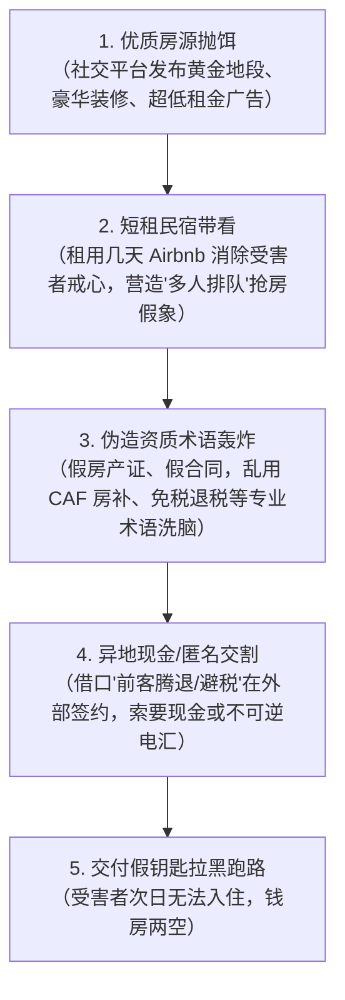

# 留法租房防骗指南

在法国各大城市，开学季房源供不应求。许多同学即便具备了“不轻信远程线上转账”的防范意识，但面对诈骗分子精心包装的“短租民宿冒充实地带看”等升级骗术，依然容易蒙受重大财产损失。

!!! abstract "租房防骗核心红线"
    * **看房严禁提前付款**：根据法国法律，在正式签署租约（Bail）之前，**租客有权免费看房，严禁收取任何“预约金”、“看房押金”或“审查费”**。凡要求看房前转账者一律直接判定为诈骗。
    * **实地带看仍需验真**：短租民宿（Airbnb/Booking）常被骗子用来假冒长租房。实地看房必须查验**房东身份证件与房屋产权证明（Titre de propriété）**。
    * **材料防盗用水印**：向房东或中介发送个人材料包前，**务必使用法国政府官方平台 [DossierFacile](https://www.dossierfacile.logement.gouv.fr/) 添加防伪水印**。
    * **法定押金上限**：空房押金最高 1 个月裸租金，家具房最高 2 个月裸租金，机动性租约（Bail mobilité）不得收押金。坚决拒付大额现金或西联汇款。

---

## 真实案例还原：短租民宿冒充长租房

!!! danger "全法学联真实案例通报"
    留学生小白在社交平台相中一套位于市中心、地段极佳、租金适中的优质公寓。为确保稳妥，小白主动联系“房东”并约定线下实地看房。
    
    看房当天，房屋真实存在且精装完备，“房东”表现得极为亲切热情，小白非常满意。但在后续签约环节，“房东”以**“目前屋内还有短期租客在住腾退，不便在房内交割”**以及**“为了帮双方合理避税省钱”**为由，约小白在公寓附近的咖啡馆签署了纸质租房合同，并要求小白**当场以现金支付相当于 3 个月租金的押金与首期租金**。“房东”随即交付了房屋钥匙。
    
    次日小白携带行李搬家入住时，才震惊发现钥匙根本无法拧开门锁；联系公寓物业后方知：**该套房屋是诈骗分子在短租平台（如 Airbnb / Booking）上仅预订了数日的民宿**。“房东”身份、房产资质与租房合同全部系伪造，此时骗子已拉黑跑路，导致小白遭受数千欧元的惨重经济损失并流落街头。

---

## 诈骗分子的四步作案链条

1. **优质房源抛饵引流**：在小红书、微信群或房屋交易网站发布位置极佳、采光一流、租金明显低于市价的“梦中情房”，迅速吸引急于落脚的新生。
2. **实地看房去疑取信**：骗子要么以“人在外地不便出面”、“委托朋友代看”推脱，要么直接租下几天民宿亲自带看，并在看房过程中刻意透露“还有好几拨学生排队交定金”，制造心理压迫感。
3. **包装流程专业洗脑**：精心伪造法国标准租赁合同（Bail de location），熟练使用 CAF 房补、担保人、杂费包干（Charges comprises）等专业词汇，使初来乍到的新生深信其为合法正规房东。
4. **异地交割现金与不可逆汇款**：以“短期房客未搬走”、“正在做最后清洁”、“帮双方避税”为借口不在房内交易，坚决要求使用**现金**、**西联汇款（Western Union）**、**MoneyGram** 或充值卡（如 Transcash, Neosurf, PCS Mastercard）等匿名性极高、无法撤销的方式付款。

---

## 租房资质核验对照标准

在签署合同或交付资金前，请严格对照下表进行资质核查：

| 校验环节 | 正规合法流程与证明文件 | 诈骗与侵权典型破绽 |
|---|---|---|
| **房东身份核验** | 房东主动出具法定身份证件（Carte nationale d'identité / Passeport）原件并允许拍照留存。 | 自称身在国外、生病、家中急事，仅出示模糊扫描件或委托无资质第三方。可在 LinkedIn、Facebook 搜索房东姓名核实背景。 |
| **房屋产权证明** | 出具房屋所有权证明（**Titre de propriété**）、近期地税单（**Avis de taxe foncière**）或近 3 个月电费单（**Facture EDF / Justificatif de domicile**）。 | 无法提供房屋产权凭据，以“隐私”为借口推脱，或出示明显经 PS 篡改的文档。 |
| **中介/代理资质** | 正规中介具备不动产职业执业证书（Carte professionnelle）与实体门面；私人代管必须出示房东亲笔签名的**法定委托书（Procuration / Mandat de gestion）**及房东身份证复印件。 | 无营业执照实体店，仅通过私人微信联系，无法提供具有法律效力的房东书面委托书。 |
| **现租客带看转租** | 法国常见由即将退房的现租客协助带看，但**现租客绝对无权签署合同或代收任何款项**；承租人转租（Sous-location）必须出示大房东书面转租许可（**Accord écrit du bailleur**）。 | 现租客私下口头转租并要求将押金转至个人账户。私下转租属非法违约行为，租客随时面临驱逐且无法申请 CAF 房补。 |
| **付款与押金方式** | 严格通过法国或欧盟银行转账（Virement bancaire）或支票支付；收款人账户名须与合同签署人姓名**严格一致**。 | 坚决要求支付大额**现金**、西联汇款、加密货币，或转账至境外无关个人账户。 |

---

## 租房防骗实操关键手段

### 1. 法定看房权与禁止预先收费
根据法国《住宅与租赁法》（Loi Alur 等法规），在双方签署正式租赁合同（Bail）之前，**租客有权免费看房，任何房东或中介严禁收取“留房定金（Frais de réservation）”、“预约金”或“看房材料审查费”**。凡是在看房前要求以任何名义转账者，100% 为诈骗。

### 2. 材料防盗用水印（DossierFacile）
向中介或房东递交租房材料包（Dossier）前，**务必使用法国生态转型部官方平台 [DossierFacile.logement.gouv.fr](https://www.dossierfacile.logement.gouv.fr/)**。
* **公共免费服务**：该平台由法国政府官方运营；
* **防伪水印防护**：上传护照、居留卡、在读证明、税单、银行流水后，系统会自动在所有文档上生成不可去除的官方水印（例如 *Document exclusivement dédié à la location immobilière*）；
* **彻底杜绝被盗**：严防不法分子将您的护照和流水盗用于冒名申请消费贷款、开设虚假空壳账户或洗钱犯罪。

### 3. 反向搜图识别网图
真实房源往往存在细微瑕疵（采光、朝向、家具成色）。对社交媒体发布的豪华精装、地段优越且低租金的“完美房源”，使用 Google 图片或百度识图进行“反向图片搜索（Recherche inversée d'images）”，往往能直接发现盗用自 Airbnb 民宿或房产设计网站的样板间网图。

### 4. 法定押金上限与支付渠道
* **空房租赁（Location nue）**：押金最高不得超过 **1 个月不含杂费裸租金**；
* **家具房租赁（Location meublée）**：押金最高不得超过 **2 个月不含杂费裸租金**；
* **机动性租约（Bail mobilité）**：法国法律明文规定房东**不得要求任何押金**；
* **支付方式底线**：必须通过银行转账（Virement）或支票，核对账户名与合同签署人一致，拒绝现金。

### 5. 现场交割与钥匙门禁当面测试
* **进门房屋状况清单（État des lieux d'entrée）**：入住当天必须与房东共同逐项检查房屋各处，记录所有破损并双方签字拍照存档；
* **当面测试所有钥匙与门禁**：必须当着房东的面，逐一插入钥匙测试公寓入户防盗门锁，测试单元大门门禁代码（Digicode）与感应磁卡（Badge）是否顺畅有效；
* **结伴看房**：初到法国的新生与女同学，看房与签约建议结伴前往，安全第一。

---

## 遭遇租房诈骗紧急救济

若不幸遭遇假房东或被骗押金，请按以下步骤紧急维权：

1. **银行紧急拦截（Recall）**：若通过银行转账，立即致电开户行客服要求启动**转账紧急召回程序（Rappel de virement / Recall）**；
2. **警方现场立案报案（Déposer plainte）**：携带租房合同、假钥匙、聊天记录、付款凭证及房东信息，前往最近的法国国家警察局（Commissariat de Police）或宪兵队（Brigade de Gendarmerie）正式报案，**索取立案证明回执（Récépissé de dépôt de plainte）**；
3. **法国国家网络反诈平台报案**：登录法国官方平台 👉 **[Thésée - Service-Public.fr](https://www.service-public.fr/particuliers/vosdroits/R62200)** 进行在线网络诈骗报案；
4. **领事保护协助**：遭遇人身侵害或需要协助，联系外交部全球领保应急热线 ☎ **+86-10-12308** 或中国驻法使领馆。
