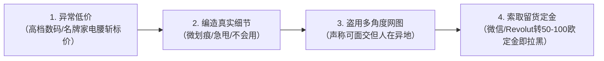
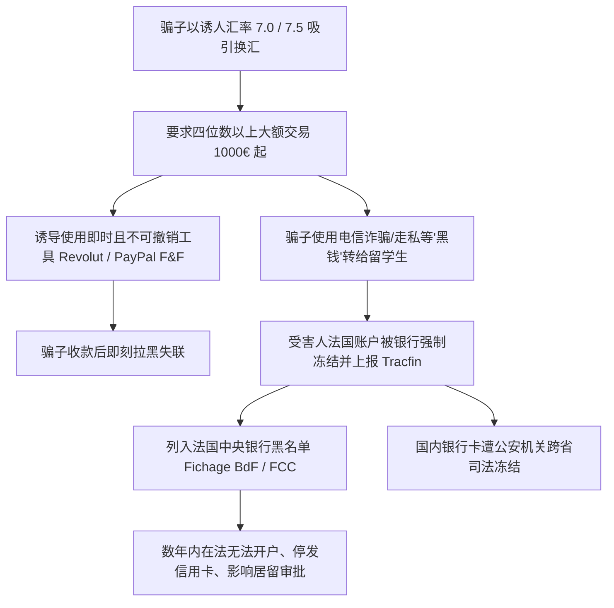

# 二手交易与私下换汇防骗指南

海外留学生初到法国或在学期交替之际，常有购置/转让二手家具家电以及兑换外汇的现实需求。犯罪分子深谙留学生群体初来乍到对同胞的信任心理，常年潜伏在微信群、小红书等平台精准实施定向欺诈。

!!! abstract "二手交易与换汇安全底线"
    * **二手交易坚守当面验货**：严格遵循**同城线下当面验货、当场测试、无误后再付款**的原则；未见到实物前，坚决不付任何形式的定金或预付款。
    * **严禁参与私下换汇**：私下换汇属中法两国外汇管理与反洗钱法规**明令禁止的非法行为**。
    * **不可逆转账陷阱**：Revolut、PayPal（Friends & Family 模式）等即时转账一经发出无法撤回；一旦接收黑灰产赃款，将面临**法国银行强制封卡、列入法国央行黑名单（Fichage BdF / FCC / FICP）数年无法开户、国内银行卡遭公安异地司法冻结**的严重后果。

---

## 一、二手交易“潜伏杀熟”模式与防范

诈骗分子通常伪装成初入法国的新生，通过各大留学公众号、新生答疑贴加入各大城市学联群、租房转租群、二手闲置群。

入群后，骗子会先潜伏数周，在群里热心参与互动打消群友顾虑；随后在毕业离校或开学采购的高峰节点，密集发布【低价出闲置二手数码/家电】信息。

### 二手交易诈骗四大典型特征

1. **虚构低价利用“捡漏”心理**：发布 iPad、MacBook、戴森吹风机、微单相机或高级电饭煲等抢手商品，标价明显低于二手市场合理残值；
2. **刻意编造细节掩人耳目**：文案中刻意标注“表面微划痕”、“仅用过一学期回国急出”、“功能完好不会使用才转让”，以此打消买家对低价的疑虑；
3. **盗取网络多角度实拍图**：图片展示详尽，甚至附带包装盒与发票网图，主动声称“支持线下当面交易”，给买家留下诚信负责的假象；
4. **索取“留货定金”**：当受害人表达购买意向后，骗子谎称“咨询的人极多，谁先付定金留给谁”，要求通过微信、支付宝或 Revolut 先转 50–100 欧定金，款项一到账即刻拉黑退群。

!!! tip "二手交易防范策略"
    * **严格同城当面交接**：同城二手买卖坚决遵循**“线下当面验货、现场开机测试、确认无误后再付款”**的铁律。
    * **未验货绝不付定金**：未亲手检验到实物之前，任凭对方以何种理由催促，坚决不支付任何形式的定金或全款。
    * **群组管理警惕陌生人**：群主与群友不随意邀请无身份认证的陌生账号入群，发现群内异常低价出物账号及时向管理员举报踢出。

---

## 二、私下换汇的致命法律与金融风险

部分同学为了省去银行跨境汇款手续费或贪图所谓“超优汇率”，选择在微信群、朋友圈与私人换汇。私下换汇不仅潜藏极高诈骗风险，更触碰中法两国的法律红线：

### 1. 虚假超优汇率与不可撤销转账陷阱
* **超优汇率诱饵**：利用留学生对汇率波动的敏感心态，报出明显背离官方外汇牌价的诱惑汇率（例如实时官方汇率 7.8 时，骗子报出 7.0 或 7.5）；
* **大额交易要求**：骗子通常只接四位数（1000 欧元以上）甚至更高金额的大额兑换；
* **不可撤销支付手段**：骗子通常诱导受害人使用 **Revolut**、**PayPal（以 Friends & Family 亲友转账模式）**、**Wise** 或即时国际电汇转账。**请注意：PayPal 的“亲友模式（Friends and Family）”没有任何商业买家保护政策（Protection des Achats），Revolut 点对点转账一经发送亦无法撤销或申诉退回**。

### 2. 触犯中法外汇与反洗钱法律红线
* **非法买卖外汇定性**：根据中国《外汇管理条例》及法国《货币与金融法典》（Code monétaire et financier），**任何个人在非指定合法金融机构私下买卖外汇，均属非法买卖外汇或非法从事资金结算的违法行为**；
* **被动卷入洗钱与电信诈骗“黑钱”**：骗子打给你的资金，绝大多数是跨境网络赌博、电信诈骗、走私贩毒洗钱的“涉案赃款”。一旦你的账户接收此类资金，**法国银行系统会自动触发反洗钱监控（Tracfin），立即强制冻结甚至注销你的银行账户**；
* **列入法国中央银行黑名单（Fichage BdF）**：涉案个人会被登记在法国中央银行不良金融记录库（Fichier Central des Chèques, FCC / FICP），面临长达数年内**在全法国任何商业银行均无法开设账户、无法使用支票、无法申请银行卡**的严重信用惩戒，直接波及日常留学生活甚至影响学生居留（Titre de séjour）的续签换发；
* **国内银行卡连带冻结**：涉及洗钱赃款的国内关联银行账户，会被国内公安机关直接执行**跨省异地司法冻结（民事/刑事冻结）**，解冻流程繁复且当事人须接受公安机关调查自证清白；
* **遭遇诈骗难以立案维权**：由于私下换汇本身属于违法违规交易，一旦资金被骗，司法机关往往难以按普通民事经济纠纷立案挽损，当事人甚至可能面临被追究非法换汇法律责任的风险。

!!! danger "换汇安全底线"
    **换汇必须且只能通过正规持牌金融机构**（如中国国内各大银行官方手机银行 App 购汇并正规电汇至法国银行卡，或在法国本地实体银行网点办理），切勿贪图蝇头小利私下换汇！

---

## 遭遇交易诈骗后的处置流程

1. **紧急挂失与召回**：
   * 银行卡被盗用：立即拨打法国银行卡 24 小时统一挂失热线 ☎ **0892 705 705**；
   * 银行电汇欺诈：第一时间联系发卡行要求启动**紧急召回（Recall de virement）**。
2. **司法报案与存证（Déposer plainte）**：
   * 保存完整的微信聊天记录、转账凭证、收款人信息，前往当地警察局或宪兵队报案，**索取立案证明回执（Récépissé de dépôt de plainte）**；
   * 登录法国国家网络欺诈报警系统 👉 **[Thésée - Service-Public.fr](https://www.service-public.fr/particuliers/vosdroits/R62200)** 提交网络交易欺诈举报。
3. **向平台与使领馆求助**：
   * 向微信团队或支付机构举报诈骗账号；
   * 如遇巨额损失或人身安全受到威胁，拨打外交部全球领保热线 ☎ **+86-10-12308**。
