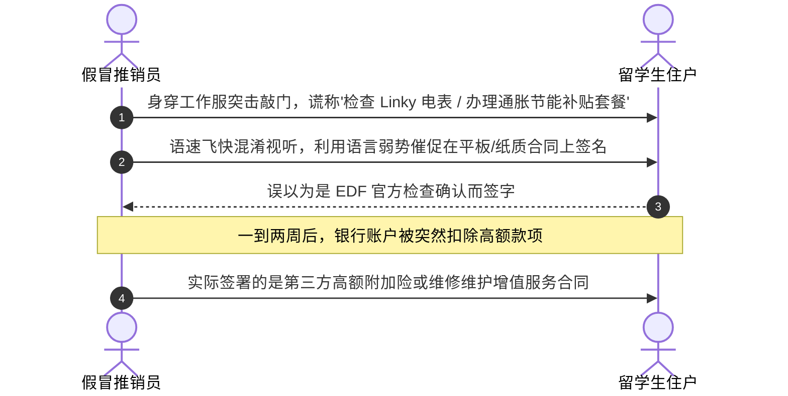
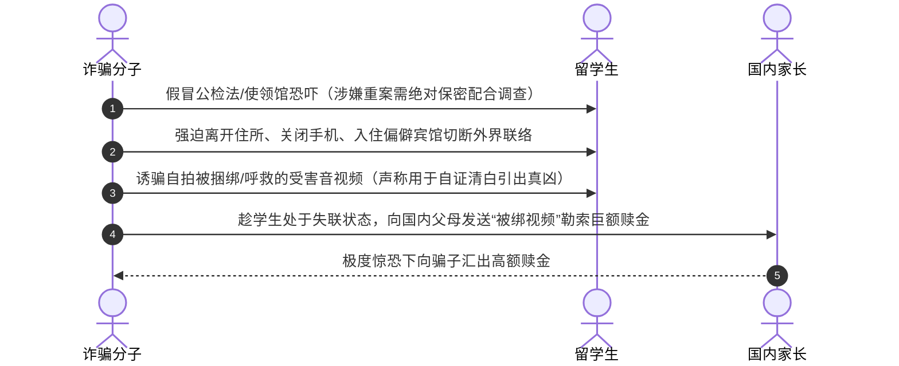
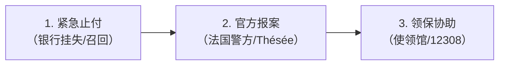

# 冒充公职与电信网络诈骗防范指南

在法求学期间，留学生常因语言障碍、对法国公共机构办事流程不够熟悉，成为不法分子实施上门诱导推销、伪造公职电信诈骗乃至恶性“虚拟绑架”的重点目标。

!!! abstract "防诈黄金铁律：一不汇，四不会"
    * **一不汇**：**只要陌生人在电话或网络中提出转账要求，无论借口多么严重逼真，一律坚决不汇！**
    * **四不会**：
      1. 中国驻外使领馆和国内公检法机关**绝不会**电话通知涉案，更不会在电话中协助转接国内公安局；
      2. 中国驻外使领馆**绝不会**电话通知护照或居留卡过期，绝不会催领未妥投的国内公文或快递包裹；
      3. 公检法机关**绝不会**通过微信、QQ、Telegram、WhatsApp、Skype 等即时通讯工具办案，绝不会在网络聊天中出示“警官证”、“通缉令”或“逮捕令”；
      4. 国内公检法机关**绝不会**要求向所谓“安全账户”或个人账户汇款，司法体系内根本不存在任何“资金审查安全账户”！

---

## 一、冒充机构与上门敲诈欺诈

### 1. 冒充 EDF 电力公司上门推销附加服务合同

近年来，法媒《巴黎人报》（Le Parisien）暗访曝光了席卷全法的“假电工推销骗局”（Démarchage à domicile abusif）：

1. **伪装身份突击敲门**：身着类似法国电力公司（EDF）蓝色工装的推销人员直接敲响公寓房门，自称“EDF 电表检测员”，以“例行检查电表（Compteur Linky）”或“应对能源通胀，协助住户办理政府节能补贴与优惠电费新套餐”为名进门。
2. **利用语言劣势诱导签名**：在简单查看电表后，推销员迅速拿出纸质合同或平板电脑催促受害者签字，语速极快地声称“这只是确认今天完成检查的手续，新套餐每月可省一大笔电费”。很多外籍留学生由于法语合同术语较多且碍于情面，未仔细逐字阅读便签下名字。
3. **高额扣费与解约陷阱**：一到两周后，受害人银行账户突然被扣除大笔费用。经核实才发现，当时签的根本不是 EDF 的电费打折协议，而是第三方经纪公司捆绑的**高额附加险或无意义的维修维护增值合同（Contrat de maintenance / Assurance dépannage）**。由于合同是当事人亲笔签名且常被推销员拖延错过法定 14 天无条件撤回反悔期（Délai de rétractation），事后申诉退费与解约流程极为艰难。

!!! warning "EDF 官方核验铁律与邮件白名单"
    * **EDF 绝不无预约直接敲门**：EDF 的电表巡检或技术维护均由法国电网管理公司 **Enedis** 执行，且**必须事先通过公寓物业在门厅张贴公告，或提前通过短信/信件与住户确认预约时间**，绝对不会未通报直接上门敲门。
    * **EDF 绝不需要向住户索要电表号**：EDF 内部数据库已严格备案并绑定了住户的电表交付点编号（PDL / PRM），凡是进门索要电表号抄录者，100% 为商业推销人员。
    * **EDF 绝不推销特定产品**：EDF 官方合作伙伴仅提供正规技术安装，绝不会主动上门向个人推销特定品牌的太阳能板或家用电器。
    * **EDF 绝不上门索取银行卡**：EDF 官方绝不会在上门时向住户索取银行卡账号、CVV 码或要求在便携式 POS 机刷卡。
    * **EDF 官方合法电子邮件域白名单**（除下列域名外，其余类似拼写的发件人均为高仿钓鱼邮件）：
      - `@edf.com`、`@edf.fr`、`@service-client-edf.fr`
      - `@relation-clients-edf.fr`、`@info-client-edf.fr`、`@informations-edf.fr`
      - `@communication-edf.fr`、`@souscrire-edf.fr`、`@tempo-edf.fr`
      - `@ejp-edf.fr`、`@economiedenergie.fr`、`@mandat-edf.com`

### 2. 假冒消防员日历募捐（Calendriers des sapeurs-pompiers）

每年 11 月中旬至 12 月底，法国全境有消防员上门向居民赠送新年日历并接受自愿慰问募捐（Tradition des étrennes）的历史传统。不法分子往往在此期间伪造消防制服上门骗取现金。

* **识别真假消防员关键要点**：
  * **正式勤务制服**：正规上门消防员必须身着统一的深蓝色消防勤务常服（Tenue de service），佩戴正规消防军衔胸章；
  * **出示专业工作证件**：居民有权要求对方出示带有本人照片的**消防职业证（Carte professionnelle）**或法国国家消防员联合会（FNSPF）会员卡；
  * **官方联谊会日历与收据**：正规日历上必定印有所在城市或街区消防站联谊会（**Amicale des sapeurs-pompiers**）的官方印章，且消防员会主动开具有票根的正规收据（Reçu）；
  * **募捐纯属自愿**：募捐金额由住户自愿决定，绝无强制最低金额要求；如对上门人员身份存疑，**有权直接礼貌拒绝开门**，或拨打 18 / 17 致电核实。

---

## 二、电信网络诈骗与钓鱼信息

### 1. 快递配送与政务钓鱼短信（Smishing 短信钓鱼）

留学生经常会收到冒充 **La Poste**、**Colissimo**、**Chronopost**、**DPD**、**UPS** 或法国医保局 **Ameli**、违章罚款局 **ANTAI** 的手机短信。

* **诈骗典型话术**：“您的国际包裹因地址不详 / 欠缴 2.99 欧元清关税款无法完成投递，请在 24 小时内点击链接补正并付款，逾期包裹将被销毁/退回”。
* **安全危害分析**：根据法国国家信息系统安全局（ANSSI）通报，短信中附带的短链接会将受害人诱导至高度仿冒的官网镜像，用于盗取受害人银行卡号、CVV 安全码与短信验证码；部分安卓手机点击后还会被诱导下载捆绑恶意木马的 APK 应用程序，从而接管手机权限。
* **防范准则**：**坚决不点击任何短信中的不明短链接**。查询国际物流或法国快递状态，请直接访问官方网站（如 laposte.fr）或官方 App 手动输入追踪单号查询。收到垃圾欺诈短信可直接免费转发至法国官方防骚扰短信平台：**33700**。

### 2. 假冒公检法与使领馆电信诈骗

1. **冒充权威公职**：利用境外改号软件，将主叫号码伪装成中国驻法国使领馆或国内各省市公安局的总机号码；
2. **电话录音恐吓**：接通后播放中文自动语音，声称接电人“护照过期”、“有加急公文未领取”、“名下信用卡涉及跨国金融洗钱案”、“涉嫌非法邮寄违禁品已被国内公安机关通缉”；
3. **转接“警方”威逼**：电话随后转接至所谓的“办案警官”，要求受害者添加 Skype、Telegram 或 WhatsApp，并通过视频或聊天窗口出示伪造的“警官证”、“刑事拘捕令”、“资产冻结保密通报”；
4. **恐吓汇款清白调查**：以“引渡回国受审”、“注销在法居留”进行心理恐吓，诱导受害人将所有银行存款转入所谓的“国家安全监管账户”或“清查保证金”。

---

## 三、“虚拟绑架”恶性衍生骗局剖析

“虚拟绑架”是针对海外留学生专门设计的极具危害性的连环诈骗：

1. **心理操控与绝对孤立**：诈骗分子以“案情涉及国家机密”为由，严厉禁止留学生向亲友、学校透露任何信息；诱导当事人交出社交账号密码，并强迫其关闭手机、退出微信，独自搬至偏僻酒店切断外界一切通讯；
2. **拍摄受害视听材料**：骗子谎称为了“配合警方演戏引出真凶”或“进行人身安全审查”，诱骗留学生自行用绳索胶带捆绑、录制哭泣求饶或私密视听资料；
3. **向国内勒索巨款**：骗子算准时间差，趁学生处于失联状态时，将上述视频发送给国内家长，谎称孩子在法遭遇黑帮绑架，勒索数百万人民币巨额赎金。家长因无法与孩子取得联系，极易陷入恐慌而盲目汇款。

!!! note "真实案例警示"
    海外曾发生多起留学生被诈骗分子诱导拍摄“被绑视频”，导致国内父母因恐慌损失数百万元巨款。待警方接报破门解救时，当事人正独自在偏僻住所等待所谓“结案通知”，完全未意识到自己已被骗子深度精神控制。

---

## 四、官方受骗维权与救济通道

若不慎遭遇诈骗或发现个人敏感信息泄露，请保持冷静，立即按照以下法定步骤阻断损失并启动司法救济：

### 1. 紧急银行止付与封卡（Opposition bancaire）
* **银行卡信息泄露或被盗刷**：
  * 立即登录手机银行 App 临时冻结卡片或关闭境外线上交易权限；
  * 拨打法国银行卡全天候统一挂失热线：☎ [0892 705 705](tel:0892705705)（24/7 全年无休）；
  * 联系开户行客户经理（Conseiller），签署欺诈非授权交易异议申诉声明，申请根据欧盟支付服务指令（DSP2）进行争议追偿。
* **已进行银行转账（Virement bancaire）**：
  * **立刻**拨打转出银行加急客服，要求立刻启动**转账紧急召回流程（Demande de rappel de virement / Recall）**；转账发出时间越短，资金成功拦截的概率越高。

### 2. 法国官方司法报案与存证（Déposer plainte）
* **前往警察局或宪兵队报案**：
  * 携带身份证件、银行转账凭单、往来邮件、聊天记录截图、通话录音等全部证据；
  * 前往所在地最近的法国国家警察局（Commissariat de Police）或宪兵队（Brigade de Gendarmerie）正式报案并做笔录（Déposer plainte）；
  * **务必索取报案证明回执（Récépissé de dépôt de plainte）**，这是后续向银行申请盗刷赔付、向保险索赔或申请法律援助的法定必备材料。
* **法国国家网络诈骗在线报警平台（Thésée）**：
  * 针对各类网络诈骗、假冒公职敲诈勒索，可直接登录法国政府官方网络反诈平台报案：  
    👉 **[Thésée - Service-Public.fr](https://www.service-public.fr/particuliers/vosdroits/R62200)**（法国国家内政部网络欺诈处理系统）。
* **钓鱼与违法网络信息举报（Pharos）**：
  * 发现涉嫌诈骗的非法网址、钓鱼邮件与网络陷阱，可提交至法国官方举报平台：  
    👉 **[Pharos (internet-signalement.gouv.fr)](https://www.internet-signalement.gouv.fr/)**。

### 3. 使领馆领事保护求助电话清单

如遇人身威胁、护照证件被扣押、陷入恶性“虚拟绑架”控制或与亲友失联，请立即拨打外交部全球领保应急热线及驻法使领馆求助电话：

| 机构名称 | 领区范围与职能 | 紧急求助电话 |
|---|---|---|
| **外交部全球领事保护与服务应急热线** | 面向全球中国公民 24 小时开通 | ☎ [+86-10-12308](tel:+861012308) 或 [+86-10-65612308](tel:+861065612308) |
| **中国驻法国大使馆** | 巴黎及大巴黎地区、中央大区、诺曼底大区等 | ☎ [+33-1 53 75 88 40](tel:+33153758840) |
| **中国驻图卢兹领保协助** | 驻马赛总领馆领区（覆盖图卢兹、马赛、尼斯、蒙彼利埃等） | ☎ [+33-4 91 32 00 19](tel:+33491320019) |
| **中国驻里昂总领馆** | 奥弗涅-罗讷-阿尔卑斯大区（里昂、格勒诺布尔等） | ☎ [+33-7 85 62 09 31](tel:+33785620931) |
| **中国驻斯特拉斯堡总领馆** | 大东部大区（斯特拉斯堡、梅斯、南锡等） | ☎ [+33-6 09 99 44 64](tel:+33609994464) |
| **中国驻圣但尼总领馆** | 留尼汪海外省 | ☎ [+262-693 92 58 07](tel:+262693925807) |
| **中国驻帕皮提领事馆** | 法属波利尼西亚 | ☎ [+689-87 29 56 20](tel:+68987295620) |
| **法国法定治安报警** | 市区警察（Police） / 郊区宪兵（Gendarmerie） | ☎ [17](tel:17) 或 欧洲通用紧急呼叫 ☎ [112](tel:112) |
| **法国紧急隐蔽短信报警** | 无法出声或身处险境时的无声求助 | 💬 发送短信至 [114](sms:114) |
