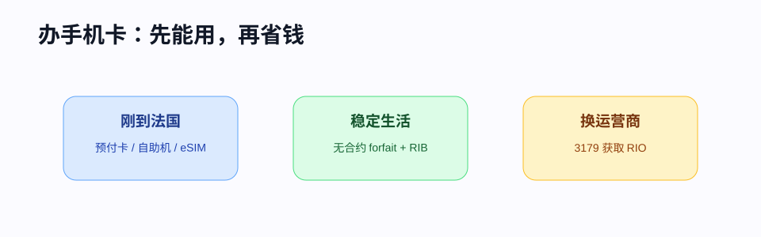

# 办理手机卡

刚到法国，手机号码会影响几乎所有行政流程：银行短信、CAF、Ameli、学校 MFA、快递、房东联系。建议先保证“能接电话和短信”，再慢慢优化套餐价格。

## 先选哪种卡

| 类型 | 法语 | 适合谁 | 特点 |
|---|---|---|---|
| 预付卡 | Carte prépayée | 刚到法国、还没有 RIB | 可快速启用，长期成本较高 |
| 无合约套餐 | Forfait sans engagement | 大多数留学生 | 可随时换，性价比高 |
| 合约套餐 | Forfait avec engagement | 需要合约机或家庭套餐 | 常有 12/24 个月绑定 |
| eSIM | eSIM | 手机支持 eSIM、临时过渡 | 开通快，但部分法国长期套餐仍要身份/RIB |

## 主要运营商

- Orange：覆盖和稳定性通常较好，价格偏高。
- SFR：覆盖广，活动多。
- Bouygues Telecom：综合均衡。
- Free Mobile：价格透明，门店自助机取卡方便。
- Sosh / RED / B&You：三大运营商旗下低价无合约品牌。
- Prixtel、Syma、La Poste Mobile 等 MVNO：价格低，注意网络承载方和客服体验。

!!! tip "第一张卡怎么省事"
    如果你刚到法国、没有 RIB，可以先买预付卡或去 Free 自助机办理，再等银行账户开好后换成更合适的无合约套餐。

## 办卡材料

不同运营商要求不同，常见包括：

- 护照或身份证件。
- 法国地址。
- 邮箱。
- 法国或 SEPA 银行 RIB/IBAN。
- 银行卡用于首月付款。

预付卡通常材料更少；长期套餐更可能要求 RIB，用于每月自动扣款。

## 携号转网

如果你已有法国号码，换运营商时可以保留号码。

1. 用当前号码拨打 `3179`，获取 **RIO** 代码。
2. 在新运营商下单时选择“保留号码 / portabilité”并填写 RIO。
3. 等新运营商处理转网和旧套餐取消。

!!! warning "不要先自己取消旧套餐"
    ARCEP 说明，携号转网时应由新运营商处理新合约、号码保留和旧合约终止。你如果先取消旧套餐，可能增加丢号风险。

## 看套餐时重点比较

| 项目 | 为什么重要 |
|---|---|
| Data 流量 | 法国很多套餐流量充足，但热点共享和限速规则不同 |
| Appels/SMS illimités | 法国境内电话短信一般无限，但国际电话另看 |
| Roaming Europe | 欧盟漫游是否含足够流量 |
| Appels vers la Chine | 是否含中国大陆电话，通常不含或另收费 |
| Sans engagement | 是否无合约，可否随时取消 |
| Frais de résiliation | 合约套餐提前取消可能有费用 |
| Prix après promotion | 首年优惠后是否涨价 |

## 取消套餐

- 无合约套餐通常可以在客户区取消，或通过携号转网自动取消。
- 有合约套餐要看剩余承诺期，提前取消可能收费。
- 退订盒子网络时注意归还设备，否则会被扣设备费。
- 离法前至少提前几周处理，避免回国后无法收验证码。

## 常见问题

### Q：法国手机号能收国内验证码吗？

不稳定。国内银行、政务、航司验证码建议保留中国手机号并开通国际漫游或备用验证方式。

### Q：没有法国银行卡能办月租吗？

部分运营商要求 RIB。没有 RIB 时，优先预付卡、eSIM 或支持银行卡付款的短期方案。

### Q：宿舍网络不好，能用手机热点替代吗？

短期可以，但长期不建议。看清套餐是否限制热点、是否有公平使用条款，以及室内信号是否稳定。

## 官方参考

- [ARCEP：携号转网说明](https://www.arcep.fr/mes-demarches-et-services/consommateurs/fiches-pratiques/comment-conserver-mon-numero-fixe-ou-mobile-lors-dun-changement-doperateur.html)
- [Service-Public：电话、互联网和电视合同](https://www.service-public.gouv.fr/particuliers/vosdroits/F19061)
