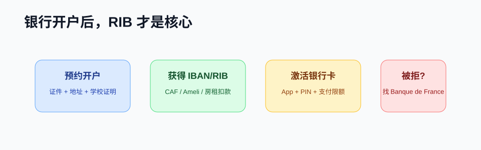

# 银行开户

!!! abstract "速览"
    * **核心产物**：开户后最重要的文件是 **RIB / IBAN**，用于办理 CAF、Ameli、手机套餐和房租扣款。→ [查看 RIB 说明](#bank-rib)
    * **办理建议**：初到法国可优先预约学校附近的传统银行实体网点；未拿到正式卡前，可从 App 导出电子版 RIB。→ [查看账户类型](#bank-account)
    * **必备材料**：护照、有效学生签证或居留、当学年在读证明、法国有效住房证明。→ [查看开户材料](#bank-materials)
    * **办理避坑**：开户被拒时索取拒开证明并了解开户权；严禁出借个人账户替他人走账。→ [查看被拒处理](#bank-refused)

在法国，银行账户不只是存钱工具。你需要 **RIB / IBAN** 来收 CAF 房补、Ameli 报销、工资或实习补贴，也需要它绑定手机套餐、住房保险、水电网和房租自动扣款。

## 账户类型怎么选 {#bank-account}

| 类型 | 代表 | 适合谁 | 注意点 |
|---|---|---|---|
| 传统银行 | BNP Paribas、Société Générale、LCL、Crédit Agricole 等 | 需要线下顾问、支票、房贷或长期服务 | 开户较慢，费用和材料要求更严格 |
| 线上银行 | BoursoBank、Hello bank! 等 | 已有法国基础材料、想降低费用 | 可能要求已有欧盟账户或居留材料 |
| 电子钱包/新银行 | Revolut、Wise、N26 等 | 刚到法国临时收付款、跨境转账 | 不一定被所有法国机构接受，注意 IBAN 国家 |

!!! tip "建议至少有一个法国 IBAN"
    法律上 SEPA 区 IBAN 应被接受，但实际行政系统、房东或保险平台可能更偏好法国 IBAN。刚到法国时可用新银行过渡，稳定后再开法国传统或线上银行账户。

## 常用开户材料 {#bank-materials}

不同银行要求不同，常见材料包括：

- 护照。
- 签证、VLS-TS 验证证明或居留卡。
- 法国地址证明：租房合同、住宿证明、水电网账单等。
- 学校录取、在读证明或学生证。
- 法国手机号和邮箱。
- 税务自我声明：银行可能询问你的税务居民身份。
- 初始存款或学生套餐申请材料。

## 开户流程

1. 选择银行并预约 rendez-vous，或在线提交开户申请。
2. 准备 PDF 扫描件和纸质原件。
3. 与顾问核验身份、地址、学习状态和税务信息。
4. 签署账户合同、银行卡合同、网银协议。
5. 收到账户信息后下载 **RIB**。
6. 激活银行卡和银行 App，设置支付限额。
7. 把 RIB 更新到 CAF、Ameli、房东、学校和雇主系统。

## RIB 上每一项是什么 {#bank-rib}

| 项目 | 用途 |
|---|---|
| IBAN | 国际银行账号，收款和自动扣款核心 |
| BIC / SWIFT | 跨境汇款或部分机构要求 |
| Titulaire | 账户持有人姓名，须与证件一致 |
| Domiciliation | 开户银行或网点信息 |

!!! warning "不要随便授权 prélèvement"
    SEPA 自动扣款很方便，但签任何 mandat de prélèvement 前要确认商家、金额、周期和取消方式。发现异常扣款应尽快联系银行。

## 如果开户被拒 {#bank-refused}

法国有 **droit au compte**（账户权利）机制。根据 Banque de France 说明，如银行拒绝开户，你可以向 Banque de France 提交材料，由其指定一家银行为你开设基础银行服务账户。

基本思路：

1. 向拒绝你的银行索要书面拒绝证明。
2. 准备身份证明、地址证明和申请表。
3. 向 Banque de France 提交 dossier。
4. Banque de France 指定银行后，尽快联系该银行开户。

!!! note "指定信有期限"
    Banque de France 说明，指定银行的信件通常自签发起 **6 个月**有效。拿到后不要拖。

## 学生常见坑

### 银行卡还没到，账户能不能用？

通常可以先使用 RIB 收款或转账，但线上支付、线下刷卡和部分扣款要等卡和 App 激活。

### 国内汇款到法国怎么省钱？

比较银行电汇、Wise、支付宝/微信合作汇款等渠道。重点看总成本：手续费、汇率差、到账时间和是否需要申报资金来源。

### 支票还重要吗？

法国仍有部分场景使用支票，例如押金、协会报名或行政费用。开户时可问银行是否提供 chéquier，以及申请条件。

### 被盗刷怎么办？

1. **第一步（线上自救）**：立刻打开手机银行 App 临时冻结银行卡（Bloquer la carte），并关闭境外交易与远程无卡支付权限。
2. **第二步（线下办理）**：携带**法定身份证件原件（护照、有效签证或居留卡，严禁仅携带学生证）**前往开户银行营业网点（Agence），要求顾问办理正式挂失异议（Opposition）并申请补发新卡。
3. **第三步（理赔调查）**：对可疑消费逐笔填写争议申诉表，银行在核实属实后将依法全额退赔被盗刷款项。若涉及卡片被盗或勒索，需第一时间前往警察局报案并向银行出具报案回执（Récépissé de plainte）。

### 留学生年度报税

每年 **3～5 月**是法国个人所得税申报期。即便没有任何收入，留学生依法完成“零申报”也有实际价值：申报后会收到官方纳税通知单（**Avis d'imposition**），在申请低租金住房、社会福利或办理居留时，是认可度很高的证明文件。

- 首次报税通常需提交纸质申报表（Formulaire 2042），之后年份可在 [impots.gouv.fr](https://www.impots.gouv.fr/) 在线完成。
- 申报窗口与流程每年可能调整，以税务机关当年通知为准。

## 开户后清单

- [ ] 下载并备份 RIB。
- [ ] 激活银行卡和网银。
- [ ] 设置合理支付和取现限额。
- [ ] 开启交易通知。
- [ ] 更新 CAF、Ameli、房东和学校账户。
- [ ] 保存银行顾问邮箱和紧急挂失电话。

## 官方参考

- [Service-Public：个人银行账户](https://www.service-public.gouv.fr/particuliers/vosdroits/F2413)
- [Banque de France：droit au compte bancaire](https://www.banque-france.fr/fr/a-votre-service/particuliers/droit-au-compte-bancaire)
- [impôts.gouv.fr：个人税务申报入口](https://www.impots.gouv.fr/)
