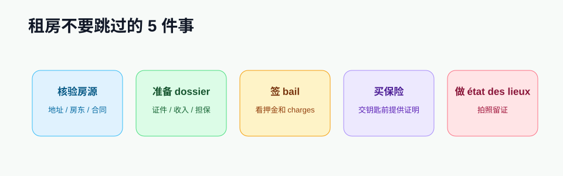

# 住房管理

住房相关事务贯穿整个留法周期：找房、签合同、买保险、申请 CAF、维修、退房、拿回押金。建议把住房文件单独建一个文件夹，所有 PDF 和照片都保存好。

## 推荐阅读顺序

1. [住宿与租房](../housing.md)：找房渠道、合同、押金、保险、防诈骗。
2. [CAF 房补](../../admin/after/caf.md)：入住后尽快申请，不要等材料完全齐才开始。
3. [银行开户](../finance/bank.md)：房租、押金、CAF 和保险通常都需要 RIB。
4. [办理手机卡](../communication/sim-card.md)：收取房东、中介、CAF、银行短信。

## 住房文件夹应保存什么

- Bail 租房合同。
- État des lieux d'entrée / sortie 入住与退房检查表。
- Attestation d'assurance habitation 住房保险证明。
- Quittance de loyer 房租收据。
- CAF 申请回执和房东填写的 attestation de loyer。
- 押金付款证明、每月房租转账记录。
- 入住、维修、退房照片。
- 房东或中介的邮件、短信、挂号信凭证。

## 每个阶段要做什么

| 阶段 | 核心任务 | 不要漏掉 |
|---|---|---|
| 找房前 | 准备 dossier | 护照、在读、资金、担保 |
| 签约前 | 读合同和费用 | 押金、charges、解约通知期 |
| 交钥匙前 | 买住房保险 | 没有保险证明可能拿不到钥匙 |
| 入住当天 | 做 état des lieux | 拍照并写进检查表 |
| 入住后 | 申请 CAF | 申请日期影响补贴起算 |
| 退房前 | 发 préavis | 留好挂号信或邮件凭证 |
| 退房当天 | 做 sortie 检查 | 交新地址和 RIB 便于退押金 |

!!! tip "把住房材料命名清楚"
    例如 `2026-09-bail.pdf`、`2026-09-assurance-habitation.pdf`、`2026-09-etat-des-lieux-entree.pdf`。续居留、CAF、银行、学校都会反复用到这些文件。

## 常用法语

| 法语 | 中文 |
|---|---|
| Bail | 租约 |
| Loyer | 房租 |
| Charges comprises | 包含杂费 |
| Dépôt de garantie | 押金 |
| Garant / caution | 担保人 |
| Assurance habitation | 住房保险 |
| Quittance de loyer | 房租收据 |
| Préavis | 退租提前通知 |
| État des lieux | 房屋状况检查 |

## 官方参考

- [Service-Public：住房主题](https://www.service-public.fr/particuliers/vosdroits/N19808)
- [Visale 官方网站](https://www.visale.fr/)
- [CAF 官方网站](https://www.caf.fr/)
